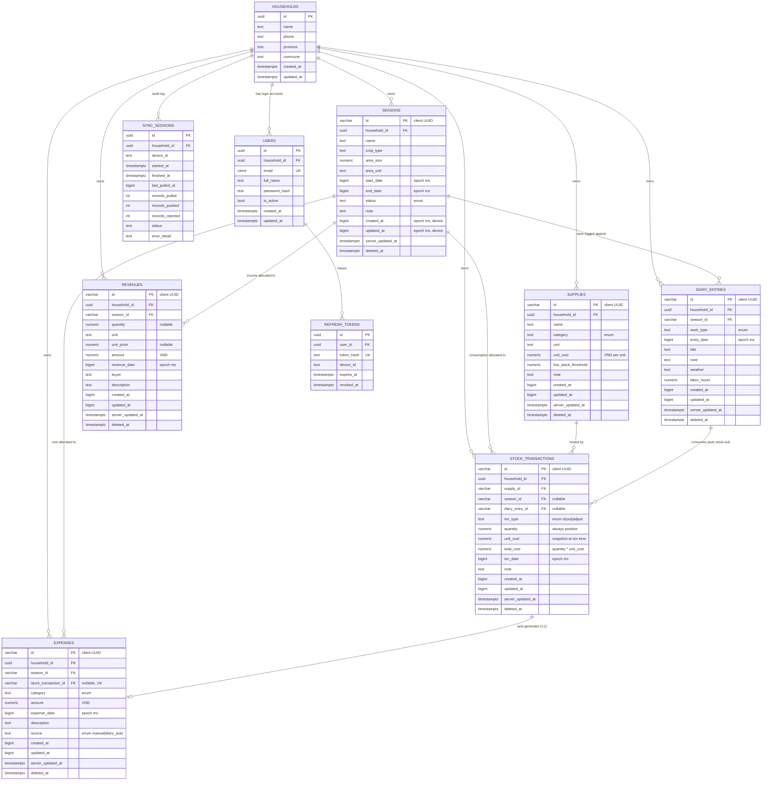

# Data Requirements — Database Layer

**Module:** Persistence (PostgreSQL system-of-record + WatermelonDB local store)
**Covers issues:** #6 (PostgreSQL schema), #7 (SQLAlchemy + Alembic), #8 (WatermelonDB local schema), #9 (sync contract data shape)
**Status:** Design frozen — implementation follows in `backend/app/models/` and `mobile/src/db/schema.ts`
**Author:** Lê Thành Thái (2212456) · AI-assisted design (Claude)

---

## Table of Contents

1. [Purpose & Scope](#1-purpose--scope)
2. [Design Rules That Constrain Every Table](#2-design-rules-that-constrain-every-table)
3. [Entity Relationship Diagram](#3-entity-relationship-diagram)
4. [Enumerations](#4-enumerations)
5. [Table Specifications](#5-table-specifications)
6. [Offline-Sync Metadata Requirements](#6-offline-sync-metadata-requirements)
7. [PostgreSQL ↔ WatermelonDB Type Parity](#7-postgresql--watermelondb-type-parity)
8. [Referential Integrity Under Sync](#8-referential-integrity-under-sync)
9. [Derived Values & Business Invariants](#9-derived-values--business-invariants)
10. [Index Plan](#10-index-plan)
11. [Reporting Query Requirements](#11-reporting-query-requirements)
12. [Seed Data for Local Development](#12-seed-data-for-local-development)
13. [Open Decisions Recorded](#13-open-decisions-recorded)

---

## 1. Purpose & Scope

This document is the single authoritative description of AgriLog's data model. Both sides of the stack are generated from it:

| Consumer | Artefact | Must match this doc on |
|---|---|---|
| Backend | `backend/app/models/*.py` (SQLAlchemy 2.0) | table names, column names, types, constraints, indexes |
| Backend | `backend/alembic/versions/*.py` | the DDL that materialises the above |
| Mobile | `mobile/src/db/schema.ts` (WatermelonDB) | table names, column names, JS-side types |
| Mobile | `mobile/src/db/models/*.ts` | field ↔ column mapping via `@field` / `@date` decorators |
| Sync | `backend/app/services/sync_service.py` | the exact set of syncable tables and their column whitelists |

**A field-name mismatch between the two schemas is the single highest-probability cause of a silent sync bug in this project.** Every column below is therefore specified with the *identical* snake_case name on both sides. There are no renames, no camelCase on the wire, and no server-only columns inside a sync payload.

### What is in scope

Seven **synced** tables (they live on the device and cross the sync boundary) and four **server-only** tables (authentication, audit, and operational data that a device never needs to own).

### What is deliberately out of scope

- Multi-tenant sharing between households (each household's data is fully isolated; there is no cross-household read path).
- Photo/attachment storage on diary entries. The proposal does not require it, and binary sync would add substantial complexity to the sync engine. Recorded in §13 as an explicit non-goal.
- Server-side soft-delete purging / GDPR-style erasure. Tombstones are retained for the lifetime of the project.

---

## 2. Design Rules That Constrain Every Table

These five rules are not negotiable per-table; they are why the columns in §5 look the way they do.

### R1 — Client-generated primary keys

Every synced record's `id` is created **on the device**, at insert time, before the network is ever consulted.

- Type: `VARCHAR(36)`, holding a lowercase UUID v4 string.
- WatermelonDB's default generator produces a 16-character random string. We override it (`setGenerator`) so that mobile IDs are RFC-4122 UUIDs, matching what the backend's seed script and any future web client produce.
- **Why:** this is what makes a retried push safe. The push handler upserts on a key the client already owns, so re-sending an identical batch after a dropped connection cannot create a second row. With server-assigned IDs, an interrupted push is genuinely ambiguous and duplicates become unavoidable.

### R2 — Two clocks, two purposes

Every synced table carries both a *client* timestamp and a *server* timestamp, and they are never used for each other's job.

| Column | Clock | Used for |
|---|---|---|
| `updated_at` (BIGINT, epoch ms) | Device | Last-write-wins conflict comparison; travels in the sync payload |
| `server_updated_at` (TIMESTAMPTZ) | PostgreSQL `now()` | The pull cursor; **never** sent to the client as a record field |

**Why two:** the pull cursor must be monotonic and trustworthy. A farmer's phone with a wrong system date must not be able to write a record stamped `2030-01-01` and thereby make itself invisible to every future pull. The cursor is therefore always server time. But *conflict* resolution genuinely wants to know which human edit happened later, which is device time — so that stays on the client clock, with a skew guard (see §6.4).

### R3 — Soft delete only

No synced row is ever removed with `DELETE`. Deletion sets `deleted_at = now()` (server clock) and bumps `server_updated_at`.

**Why:** a hard delete is invisible to a device that was offline when it happened. The pull endpoint has to be able to answer "what was destroyed since your cursor?", which requires a tombstone to survive.

### R4 — Every synced row is household-scoped

Every synced table has a non-null `household_id`. Every query in the API layer, without exception, filters on the authenticated household. There is no endpoint that can return another household's row.

### R5 — Money and quantity are explicit

- Money: `NUMERIC(16, 2)`, denominated in **VND**. Sixteen digits comfortably covers a season's revenue in đồng.
- Quantity: `NUMERIC(14, 3)` — three decimals handles `0.250 kg`, `12.500 L`, `1.750 bao`.
- On the client both become JavaScript `number` (IEEE-754 float64). See §7 for the precision analysis and the rounding contract.

---

## 3. Entity Relationship Diagram



### Reading the two most important relationships

**`DIARY_ENTRIES → STOCK_TRANSACTIONS` (1:N, nullable FK).**
A single diary entry ("phun thuốc 12/09") may consume several supplies. Each consumption is one `stock_transactions` row with `txn_type = 'out'` and `diary_entry_id` set. A stock-out recorded straight from the inventory screen simply leaves `diary_entry_id` NULL. This means there is exactly **one inventory ledger** rather than a separate "usage" table that has to be kept consistent with it — which is what makes "hoàn kho" (Issues #25, #26) a bounded, testable operation: reconcile the set of child rows for one parent.

**`STOCK_TRANSACTIONS → EXPENSES` (1:0..1, unique FK).**
Every supply consumption that came from a diary entry auto-generates exactly one expense row, carrying `source = 'diary_auto'` and `stock_transaction_id` pointing back. The uniqueness constraint on `stock_transaction_id` is what makes Issue #29 idempotent: the generator can only ever produce one expense per movement, so re-running it after a sync retry cannot double-count the farmer's costs.

---

## 4. Enumerations

Stored as `TEXT` with a `CHECK` constraint, **not** as a PostgreSQL `ENUM` type.

**Why TEXT + CHECK:** WatermelonDB has no enum type, so the value crosses the wire as a plain string regardless. Native PG enums also require an `ALTER TYPE` migration to extend, which is awkward to keep in lockstep with a mobile schema version. A `CHECK` constraint gives the same integrity with a one-line migration to widen.

| Enum | Column(s) | Allowed values | Vietnamese label (UI) |
|---|---|---|---|
| `work_type` | `diary_entries.work_type` | `land_prep` | Làm đất |
| | | `sowing` | Gieo/Trồng |
| | | `fertilizing` | Bón phân |
| | | `spraying` | Phun thuốc |
| | | `watering` | Tưới nước |
| | | `weeding` | Làm cỏ |
| | | `harvesting` | Thu hoạch |
| | | `other` | Khác |
| `supply_category` | `supplies.category` | `fertilizer` | Phân bón |
| | | `pesticide` | Thuốc BVTV |
| | | `seed` | Giống |
| | | `fuel` | Nhiên liệu |
| | | `tool` | Dụng cụ |
| | | `other` | Khác |
| `txn_type` | `stock_transactions.txn_type` | `in` | Nhập kho |
| | | `out` | Xuất kho |
| | | `adjust` | Điều chỉnh (kiểm kê) |
| `expense_category` | `expenses.category` | `supply` | Vật tư |
| | | `labor` | Nhân công |
| | | `machinery` | Máy móc |
| | | `transport` | Vận chuyển |
| | | `land_rent` | Thuê đất |
| | | `irrigation` | Thủy lợi |
| | | `other` | Khác |
| `expense_source` | `expenses.source` | `manual` | — |
| | | `diary_auto` | — |
| `season_status` | `seasons.status` | `planning` | Chuẩn bị |
| | | `active` | Đang canh tác |
| | | `harvested` | Đã thu hoạch |
| | | `closed` | Đã kết thúc |

The canonical list lives in **one place per side** — `backend/app/models/enums.py` and `mobile/src/db/enums.ts` — and a backend test asserts that every `CHECK` constraint in the live database matches the Python tuple, so a value added on one side and forgotten on the other fails CI rather than production.

---

## 5. Table Specifications

Legend: **PK** primary key · **FK** foreign key · **UK** unique · **NN** not null · *(sync)* participates in sync payloads

### 5.1 `households` — server-only

The tenant. Created once at registration; a device never edits it.

| Column | Type | Constraints | Notes |
|---|---|---|---|
| `id` | `UUID` | PK, default `gen_random_uuid()` | Server-generated — registration is inherently online |
| `name` | `TEXT` | NN | e.g. "Hộ ông Lê Văn A" |
| `phone` | `VARCHAR(20)` | NULL | Contact only, not a login identifier |
| `province` | `TEXT` | NULL | e.g. "Lâm Đồng" |
| `commune` | `TEXT` | NULL | |
| `created_at` | `TIMESTAMPTZ` | NN, default `now()` | Server clock — this table is not synced |
| `updated_at` | `TIMESTAMPTZ` | NN, default `now()` | |

### 5.2 `users` — server-only

| Column | Type | Constraints | Notes |
|---|---|---|---|
| `id` | `UUID` | PK, default `gen_random_uuid()` | |
| `household_id` | `UUID` | FK → `households.id`, NN, `ON DELETE CASCADE` | |
| `email` | `CITEXT` | UK, NN | `citext` extension → case-insensitive login |
| `full_name` | `TEXT` | NN | |
| `password_hash` | `TEXT` | NN | bcrypt, cost 12. **Never** leaves the server |
| `is_active` | `BOOLEAN` | NN, default `TRUE` | |
| `created_at` / `updated_at` | `TIMESTAMPTZ` | NN, default `now()` | |

**Requirement:** more than one user may belong to a household (a farmer and an adult child both logging work from separate phones). This is precisely the scenario Issue #40's two-device conflict test exercises, so the schema must permit it from day one.

### 5.3 `refresh_tokens` — server-only

| Column | Type | Constraints | Notes |
|---|---|---|---|
| `id` | `UUID` | PK | |
| `user_id` | `UUID` | FK → `users.id`, NN, `ON DELETE CASCADE` | |
| `token_hash` | `TEXT` | UK, NN | SHA-256 of the token; the raw token is never stored |
| `device_id` | `TEXT` | NULL | Client-generated stable device identifier |
| `expires_at` | `TIMESTAMPTZ` | NN | 90 days |
| `revoked_at` | `TIMESTAMPTZ` | NULL | Set on logout |
| `created_at` | `TIMESTAMPTZ` | NN, default `now()` | |

**Requirement driven by offline use:** the access token lives 7 days and the refresh token 90 days. A device that has been in a field with no signal for three weeks must still be able to sync when it reconnects, without the farmer being bounced to a login screen holding three weeks of unsynced work.

### 5.4 `seasons` *(sync)*

| Column | Type | Constraints | Notes |
|---|---|---|---|
| `id` | `VARCHAR(36)` | PK | Client UUID (R1) |
| `household_id` | `UUID` | FK → `households.id`, NN | R4 |
| `name` | `TEXT` | NN, length 1–120 | "Vụ Đông Xuân 2026" |
| `crop_type` | `TEXT` | NN, length 1–80 | "Lúa", "Cà chua", "Bắp cải" |
| `area_size` | `NUMERIC(10,3)` | NULL, `>= 0` | |
| `area_unit` | `VARCHAR(16)` | NN, default `'sao'` | `sao` / `ha` / `m2` / `công` |
| `start_date` | `BIGINT` | NN | Epoch ms |
| `end_date` | `BIGINT` | NULL | Epoch ms. NULL = season still running |
| `status` | `TEXT` | NN, default `'active'`, CHECK enum | |
| `note` | `TEXT` | NULL | |
| *sync block* | | | See §6.1 |

**Validation:** `end_date IS NULL OR end_date >= start_date`, enforced as a table `CHECK` **and** in the Pydantic schema **and** in the mobile form. Three layers, because a bad range silently breaks every report query that filters by season window.

### 5.5 `supplies` *(sync)*

| Column | Type | Constraints | Notes |
|---|---|---|---|
| `id` | `VARCHAR(36)` | PK | |
| `household_id` | `UUID` | FK, NN | |
| `name` | `TEXT` | NN, length 1–120 | "Đạm Urê Phú Mỹ" |
| `category` | `TEXT` | NN, CHECK enum | |
| `unit` | `VARCHAR(16)` | NN | `kg` / `L` / `bao` / `chai` / `gói` |
| `unit_cost` | `NUMERIC(16,2)` | NN, default `0`, `>= 0` | Current reference price, VND per `unit` |
| `low_stock_threshold` | `NUMERIC(14,3)` | NN, default `0`, `>= 0` | Drives the low-stock flag (Issue #24) |
| `note` | `TEXT` | NULL | |
| *sync block* | | | |

**Deliberately absent: `current_stock`.** On-hand quantity is **never** a stored column. It is always `Σ(in) + Σ(adjust) − Σ(out)` over non-deleted `stock_transactions`.

**Why:** a stored counter has to be mutated by both the server and every offline device, and two devices each decrementing a cached counter while offline produce a number that is simply wrong after sync — with no way to detect it. Deriving from an append-only ledger means the two devices contribute two independent transaction rows, both sync cleanly, and the total is correct by construction. This is the central data-modelling decision of the inventory module. The cost is a `SUM` per read, which §10 indexes for and §11 caches at the UI layer.

**Unique constraint:** `(household_id, lower(name), unit) WHERE deleted_at IS NULL` — prevents "Đạm Urê" being created twice on two devices as two separate inventory lines. Note this is *not* bulletproof across a partition (both devices are offline, both create it, both push); §8.3 documents the merge procedure.

### 5.6 `stock_transactions` *(sync)*

The append-only inventory ledger.

| Column | Type | Constraints | Notes |
|---|---|---|---|
| `id` | `VARCHAR(36)` | PK | |
| `household_id` | `UUID` | FK, NN | |
| `supply_id` | `VARCHAR(36)` | FK → `supplies.id`, NN, DEFERRABLE | |
| `season_id` | `VARCHAR(36)` | FK → `seasons.id`, NULL, DEFERRABLE | Cost allocation; NULL for general stock-in |
| `diary_entry_id` | `VARCHAR(36)` | FK → `diary_entries.id`, NULL, DEFERRABLE | Set ⟺ movement originated from a diary entry |
| `txn_type` | `TEXT` | NN, CHECK `in`/`out`/`adjust` | |
| `quantity` | `NUMERIC(14,3)` | NN, `> 0` for in/out | Always positive; direction comes from `txn_type` |
| `unit_cost` | `NUMERIC(16,2)` | NN, default `0`, `>= 0` | **Snapshot** of `supplies.unit_cost` at the moment of the transaction |
| `total_cost` | `NUMERIC(16,2)` | NN, default `0`, `>= 0` | `quantity × unit_cost`, computed and stored |
| `txn_date` | `BIGINT` | NN | Epoch ms |
| `note` | `TEXT` | NULL | |
| *sync block* | | | |

**Why `unit_cost` is snapshotted rather than joined:** fertiliser bought in March at 12,000 ₫/kg and used in September must be costed at what it actually cost, not at today's catalogue price. Joining live to `supplies.unit_cost` would silently rewrite the financial history of every past season every time the farmer updates a price. `total_cost` is likewise stored, not computed on read, so that a report is reproducible.

**`quantity > 0` for `in` and `out`; `adjust` permits any non-zero value** (a stock-take can correct in either direction). Encoded as:
`CHECK ((txn_type IN ('in','out') AND quantity > 0) OR (txn_type = 'adjust' AND quantity <> 0))`

### 5.7 `diary_entries` *(sync)*

| Column | Type | Constraints | Notes |
|---|---|---|---|
| `id` | `VARCHAR(36)` | PK | |
| `household_id` | `UUID` | FK, NN | |
| `season_id` | `VARCHAR(36)` | FK → `seasons.id`, NN, DEFERRABLE | Every log belongs to a season |
| `work_type` | `TEXT` | NN, CHECK enum | |
| `entry_date` | `BIGINT` | NN | Epoch ms |
| `title` | `TEXT` | NULL, length ≤ 160 | Optional short label |
| `note` | `TEXT` | NULL | Free text |
| `weather` | `VARCHAR(32)` | NULL | `sunny` / `cloudy` / `rain` / `storm` |
| `labor_hours` | `NUMERIC(6,2)` | NULL, `>= 0` | Informational |
| *sync block* | | | |

Supply consumption is **not** stored on this table — it lives in `stock_transactions` rows pointing back via `diary_entry_id` (§3). The mobile form presents them as one screen; the data model keeps them as parent + ledger children.

### 5.8 `expenses` *(sync)*

| Column | Type | Constraints | Notes |
|---|---|---|---|
| `id` | `VARCHAR(36)` | PK | |
| `household_id` | `UUID` | FK, NN | |
| `season_id` | `VARCHAR(36)` | FK → `seasons.id`, NN, DEFERRABLE | Cost must be attributable to a season |
| `stock_transaction_id` | `VARCHAR(36)` | FK → `stock_transactions.id`, NULL, **UK**, DEFERRABLE | Set ⟺ `source = 'diary_auto'` |
| `category` | `TEXT` | NN, CHECK enum | |
| `amount` | `NUMERIC(16,2)` | NN, `>= 0` | VND |
| `expense_date` | `BIGINT` | NN | Epoch ms |
| `description` | `TEXT` | NULL | |
| `source` | `TEXT` | NN, default `'manual'`, CHECK `manual`/`diary_auto` | |
| *sync block* | | | |

**Paired constraint:** `CHECK ((source = 'diary_auto') = (stock_transaction_id IS NOT NULL))` — the two fields cannot disagree.

**Unique index:** `UNIQUE (stock_transaction_id) WHERE stock_transaction_id IS NOT NULL` — the idempotency guarantee for Issue #29.

Auto-generated rows are **read-only in the UI**. Editing the underlying diary entry's supply usage is the only way to change them; the mobile form disables the amount field and shows "Tự động từ nhật ký". Allowing a farmer to hand-edit a derived number would make the auto-generator and the stored value diverge with no way to reconcile them at sync time.

### 5.9 `revenues` *(sync)*

| Column | Type | Constraints | Notes |
|---|---|---|---|
| `id` | `VARCHAR(36)` | PK | |
| `household_id` | `UUID` | FK, NN | |
| `season_id` | `VARCHAR(36)` | FK → `seasons.id`, NN, DEFERRABLE | |
| `quantity` | `NUMERIC(14,3)` | NULL, `>= 0` | Harvest sold, e.g. `1250.000` |
| `unit` | `VARCHAR(16)` | NULL | `kg` / `tấn` / `bao` |
| `unit_price` | `NUMERIC(16,2)` | NULL, `>= 0` | VND per unit |
| `amount` | `NUMERIC(16,2)` | NN, `>= 0` | VND. Authoritative total |
| `revenue_date` | `BIGINT` | NN | Epoch ms |
| `buyer` | `TEXT` | NULL | "Thương lái Sáu Tâm" |
| `description` | `TEXT` | NULL | |
| *sync block* | | | |

`amount` is authoritative and always stored, even when `quantity × unit_price` is also present. The UI pre-fills `amount` from the product but lets the farmer override it (real sales get rounded, discounted, or partially paid). Deriving `amount` on read would silently discard that override.

### 5.10 `sync_sessions` — server-only, audit

Not synced. Written by the sync endpoints; read by the load tests (Issue #39) and the operational dashboard.

| Column | Type | Constraints | Notes |
|---|---|---|---|
| `id` | `UUID` | PK | |
| `household_id` | `UUID` | FK, NN | |
| `device_id` | `TEXT` | NULL | From the `X-Device-Id` header |
| `direction` | `TEXT` | NN, CHECK `pull`/`push` | |
| `started_at` | `TIMESTAMPTZ` | NN, default `now()` | |
| `finished_at` | `TIMESTAMPTZ` | NULL | |
| `last_pulled_at` | `BIGINT` | NULL | Cursor the client presented |
| `records_pulled` | `INTEGER` | NN, default `0` | |
| `records_pushed` | `INTEGER` | NN, default `0` | |
| `records_rejected` | `INTEGER` | NN, default `0` | Losers of a last-write-wins comparison |
| `status` | `TEXT` | NN, CHECK `ok`/`partial`/`error` | |
| `error_detail` | `TEXT` | NULL | |

This table is how "sync latency" and "conflict rate" stop being adjectives in the thesis report and become measured numbers.

---

## 6. Offline-Sync Metadata Requirements

### 6.1 The server-side sync block

Every synced table appends these five columns. In SQLAlchemy they come from a single `SyncMixin` so they cannot drift:

```
created_at         BIGINT       NOT NULL          -- epoch ms, DEVICE clock
updated_at         BIGINT       NOT NULL          -- epoch ms, DEVICE clock  → LWW comparison
server_updated_at  TIMESTAMPTZ  NOT NULL now()    -- SERVER clock            → pull cursor
deleted_at         TIMESTAMPTZ  NULL              -- tombstone (server clock)
last_device_id     TEXT         NULL              -- who wrote this version (audit)
```

`server_updated_at` is maintained by a **database trigger**, not by application code:

```sql
CREATE OR REPLACE FUNCTION touch_server_updated_at() RETURNS trigger AS $$
BEGIN
  NEW.server_updated_at := clock_timestamp();
  RETURN NEW;
END;
$$ LANGUAGE plpgsql;
```

**Why a trigger and not `onupdate=` in SQLAlchemy:** the seed script, a manual `UPDATE` in pgAdmin, and a future admin tool all bypass the ORM. Any write that escapes the ORM without bumping the cursor becomes a row that is permanently invisible to every device — the worst class of sync bug, because the data is present on the server and simply never arrives. Enforcing it in the database makes that unrepresentable.

**Why `clock_timestamp()` and emphatically not `now()`:** `now()` is `transaction_timestamp()` — every statement in a transaction receives the time the *transaction began*. A sync push applies its whole batch in one transaction by design (§6.6), so with `now()` every row in a long push is stamped with a time that may already be behind a cursor another pull has stored — and those rows are then never delivered again. `clock_timestamp()` stamps each row when it is actually written. This was a real defect, caught by a regression test before any client existed; the full analysis is in [Error_Sync_Cursor_Transaction_Timestamp.md](Error_Sync_Cursor_Transaction_Timestamp.md).

### 6.2 The client-side sync block

WatermelonDB maintains its own bookkeeping columns automatically. They are **local only** and never appear in a payload:

| Column | Maintained by | Meaning |
|---|---|---|
| `id` | Our UUID generator | Primary key (R1) |
| `_status` | WatermelonDB | `created` \| `updated` \| `synced` \| `deleted` — the pending-change queue |
| `_changed` | WatermelonDB | Comma-separated list of locally-modified fields — drives per-field merge on pull |
| `created_at` | Our model (`@readonly @date`) | Mirrors the server column |
| `updated_at` | Our model (`@date`) | Mirrors the server column |

`_status` is why AgriLog needs no outbox table: the local database *is* the queue. The pending-change badge in the sync status bar (Issue #35) is literally `Q.where('_status', Q.notEq('synced'))` counted across the seven synced tables.

**Requirement:** the mobile schema must **not** declare `_status`, `_changed`, `server_updated_at`, `deleted_at`, or `last_device_id` as columns in `schema.ts`. The first two are added by WatermelonDB itself (declaring them causes a schema conflict), and the last three are server concerns that must never round-trip.

### 6.3 Payload column whitelist

The pull serialiser emits, for each record: every business column from §5, plus `id`, `created_at`, `updated_at`. It emits **nothing else**. Specifically excluded: `server_updated_at`, `deleted_at`, `last_device_id`, and `household_id`.

**Why exclude `household_id`:** the client already knows its household from the JWT, and every row it can ever see belongs to it. Sending it would add a column to seven WatermelonDB tables that carries zero information and creates a seventh chance for a schema mismatch. The server re-attaches it on push from the authenticated token — which also means a malicious client cannot write into another household by forging the field, because the field is not read from the payload at all.

### 6.4 Clock-skew guard

On push, before the last-write-wins comparison:

```
if incoming.updated_at > server_now_ms + 300_000:      # more than 5 minutes ahead
    incoming.updated_at = server_now_ms                 # clamp
    log to sync_sessions.error_detail
```

Without this, one phone with a misconfigured date can set `updated_at` to a far-future value and permanently win every subsequent conflict on that record — every other device's edits vanish silently, forever. Five minutes is generous enough to absorb ordinary NTP drift and short enough that a wrong-year clock is caught.

### 6.5 The pull cursor contract

```
GET /sync/pull?last_pulled_at=<epoch_ms>&schema_version=<int>&migration=<json|null>
```

Server behaviour:

0. `cursor := last_pulled_at − SYNC_CURSOR_SAFETY_MARGIN_MS` (2 000 ms) — see below.
1. `now_ts := SELECT clock_timestamp()` — captured **once**, at the very start of the request, before any table is read.
2. For each of the seven synced tables:
   - `created` ← rows where `server_updated_at > cursor AND deleted_at IS NULL AND created_at > cursor`
   - `updated` ← rows where `server_updated_at > cursor AND deleted_at IS NULL AND created_at <= cursor`
   - `deleted` ← **bare id strings** where `server_updated_at > cursor AND deleted_at IS NOT NULL`
3. Return `{ "changes": {...}, "timestamp": <now_ts as epoch ms> }`.
4. `last_pulled_at = 0` (or absent) means a full bootstrap: every live row, all in `created`.

**Why the cursor is rewound by a safety margin (step 0):** a row is *stamped* when it is written but only becomes *visible* when its transaction commits. A transaction that writes at T5 and commits at T8 is invisible to a pull running at T6 — which would then store cursor T6 and skip that row forever. Rewinding by more than the longest write transaction closes the window. Re-delivering a row is harmless because the client upserts on a client-generated ID (R1), so a duplicate pull is a no-op. The margin must exceed the duration of the largest push batch; Issue #39's load test measures this and revisits the value.

**Why `now_ts` is captured before reading, not after:** if it were taken at the end, a row committed by another device *during* the read would fall before the returned cursor and never be pulled again. Taking it first means such a row is at worst pulled twice — and since the client applies changes as an upsert, a duplicate pull is a no-op. The design trades a redundant row for the impossibility of a lost one.

**Why the `created` / `updated` split uses `created_at`:** WatermelonDB will error on `created` containing a record it already has, and on `updated` containing one it does not. The split must therefore be relative to the *client's* cursor, not to any server-side notion of newness.

### 6.6 The push contract

```
POST /sync/push?last_pulled_at=<epoch_ms>
Body: { "changes": { "<table>": { "created": [...], "updated": [...], "deleted": ["id", ...] } } }
```

Server behaviour:

1. Open **one** transaction for the entire batch.
2. Apply tables in strict dependency order (§8.1).
3. Treat `created` and `updated` identically — both are an **upsert on `id`** (R1). A device that created a row, synced, then had the response lost will resend it in `created`; treating that as an error would deadlock the device forever.
4. Per row, compare `incoming.updated_at` against `stored.updated_at`:
   - strictly greater → apply, set `last_device_id`, trigger bumps `server_updated_at`
   - less or equal → **reject that row**, increment `records_rejected`, and report it in the response
5. Deletes set `deleted_at = now()` and are idempotent (deleting an already-deleted row is success, not error).
6. Commit. On any exception, roll back the whole batch and return 409/500 — the client keeps every record at `_status != 'synced'` and retries. There is no partial-apply state to reconcile.

Response:

```jsonc
{
  "accepted": 143,
  "rejected": [
    { "table": "diary_entries", "id": "8f3c…", "reason": "stale_update",
      "server_updated_at": 1767312000000 }
  ],
  "timestamp": 1767312001234
}
```

**Why report rejections rather than silently dropping them:** a farmer whose edit lost a last-write-wins race deserves to be told, not to discover three weeks later that the note never saved. The client surfaces this in the sync status UI (Issue #35).

---

## 7. PostgreSQL ↔ WatermelonDB Type Parity

WatermelonDB supports exactly three column types: `string`, `number`, `boolean`. Every PostgreSQL type must map into one of them without loss.

| Concept | PostgreSQL | WatermelonDB | Decorator | Loss analysis |
|---|---|---|---|---|
| Primary key | `VARCHAR(36)` | *(implicit `id`)* | — | None — UUID string both sides |
| Foreign key | `VARCHAR(36)` | `string` | `@relation` / `@field` | None |
| Short text | `TEXT` / `VARCHAR(n)` | `string` | `@text` | Length limits enforced client-side by the form, server-side by the column |
| Free text | `TEXT` | `string` (`isOptional`) | `@text` | None |
| Enum | `TEXT` + CHECK | `string` | `@field` | Constraint is server-only; client validates against `enums.ts` |
| Money (VND) | `NUMERIC(16,2)` | `number` | `@field` | **See below** |
| Quantity | `NUMERIC(14,3)` | `number` | `@field` | **See below** |
| Business date | `BIGINT` (epoch ms) | `number` | `@date` | None — this is exactly WatermelonDB's own date representation |
| Sync timestamp | `BIGINT` (epoch ms) | `number` | `@readonly @date` | None |
| Server timestamp | `TIMESTAMPTZ` | *(not exposed)* | — | Never crosses the wire (§6.3) |
| Boolean | `BOOLEAN` | `boolean` | `@field` | None |

### 7.1 The `NUMERIC → number` precision contract

This is the only lossy mapping in the schema, so it is specified rather than assumed.

JavaScript numbers are IEEE-754 float64: integers are exact up to 2⁵³ ≈ 9.007 × 10¹⁵, but decimal fractions such as `0.1` are not exactly representable.

**Money.** VND has no sub-unit in practice; every real amount is a whole number of đồng. The largest plausible value in this application — a season's gross revenue for a smallholder — is on the order of 10⁹ ₫, which is eleven orders of magnitude below the exact-integer ceiling. Money is therefore **exact** in float64 for every value this app will ever hold. The `NUMERIC(16,2)` scale exists to absorb the rare `.50` and to keep the column honest, not because fractions are expected.

**Quantity.** `12.5 kg` is representable; `0.1 + 0.2 = 0.30000000000000004` is the classic hazard. The contract:

- The client rounds every quantity to 3 decimals before writing: `Math.round(q * 1000) / 1000`.
- The server rounds every incoming quantity to 3 decimals before storing: `Decimal(str(q)).quantize(Decimal('0.001'), ROUND_HALF_UP)`.
- All server-side arithmetic (stock levels, cost rollups) uses Python `Decimal`, never `float`.
- A backend test asserts round-trip stability: write `0.1`, `0.2`, `0.3`, sum them, and assert exactly `0.600`.

Because both sides round identically at the boundary, the stored value on device and server is bit-identical, and last-write-wins never fires spuriously on a value that only *looks* different.

### 7.2 Date handling

Business dates (`start_date`, `entry_date`, `txn_date`, `expense_date`, `revenue_date`) are stored as `BIGINT` epoch milliseconds in PostgreSQL rather than as `DATE` or `TIMESTAMPTZ`.

**Why:** WatermelonDB's `@date` decorator stores epoch ms. Storing `DATE` server-side would require a conversion at both edges of every sync, and a conversion is a place where a timezone can be applied inconsistently — the classic symptom being an entry logged at 8 p.m. on the 12th appearing under the 13th after a sync. Epoch ms is the same integer everywhere and needs no interpretation to round-trip.

**The cost** is that SQL date grouping for reports is not free. Vietnam is UTC+7 year-round with no daylight saving, so the local calendar day is exact integer arithmetic:

```sql
-- local day index, immutable → indexable, added in the reporting migration (Issue #42)
ALTER TABLE expenses ADD COLUMN expense_day_local INTEGER
  GENERATED ALWAYS AS (((expense_date + 25200000) / 86400000)::INTEGER) STORED;
```

`25200000` is 7 hours in milliseconds. The same generated column is added to `revenues.revenue_date`, `diary_entries.entry_date`, and `stock_transactions.txn_date`. Grouping by month uses `to_char(to_timestamp((expense_date + 25200000) / 1000.0) AT TIME ZONE 'UTC', 'YYYY-MM')`.

The offset constant lives in `backend/app/core/config.py` as `APP_TZ_OFFSET_MS` and in `mobile/src/utils/date.ts` as `TZ_OFFSET_MS`, so the client's local grouping and the server's produce identical buckets. If the app is ever deployed outside a fixed-offset timezone, this is the assumption that breaks — recorded in §13.

---

## 8. Referential Integrity Under Sync

### 8.1 Table apply order

A sync batch is a flat set of tables, but the rows have dependencies. Both push (server) and pull (client) apply in this order:

```
1. seasons              (depends on nothing but households)
2. supplies             (depends on nothing but households)
3. diary_entries        (→ seasons)
4. stock_transactions   (→ supplies, seasons, diary_entries)
5. expenses             (→ seasons, stock_transactions)
6. revenues             (→ seasons)
```

Deletes are applied in **reverse** order so a parent is never tombstoned while a live child still points at it.

### 8.2 Deferred constraints

All FKs between synced tables are declared `DEFERRABLE INITIALLY DEFERRED`.

**Why:** even with the ordering in §8.1, a single batch can contain a `stock_transactions` row whose `diary_entry_id` refers to a diary entry in the *same* batch. Ordering handles that. What ordering does not handle is a `RESTRICT` violation raised mid-batch on a row that a later statement in the same transaction would have fixed. Deferring the check to `COMMIT` means the batch is validated as a whole — which is the correct semantics, since the batch *is* the unit of atomicity.

### 8.3 Orphan and duplicate policy

| Situation | Policy |
|---|---|
| Child arrives, parent missing entirely (parent still on another device) | Reject **the child row only**, report `reason: "missing_parent"`. The client retries next cycle, by which time the parent has usually arrived. The batch is not failed. |
| Parent soft-deleted, child still live | Server cascades the soft delete to children in the same transaction (see §9.3) |
| Same supply created independently on two offline devices | Both rows sync and coexist as two inventory lines. This is *correct* — silently merging two rows a human might have meant as distinct is worse than showing both. The UI surfaces a "possible duplicate" hint on the inventory screen; merging is a manual, explicit action. Documented as a known limitation for the thesis. |
| Row pushed for a household the JWT does not own | Reject the whole request with 403. This is not a sync error, it is an authorisation failure. |

### 8.4 Cascade rules

| Parent | Child | On soft delete |
|---|---|---|
| `seasons` | `diary_entries`, `expenses`, `revenues`, `stock_transactions` | Cascade soft delete |
| `diary_entries` | `stock_transactions` (where `diary_entry_id` set) | Cascade soft delete **+ stock restore** (§9.2) |
| `stock_transactions` | `expenses` (via `stock_transaction_id`) | Cascade soft delete |
| `supplies` | `stock_transactions` | **Block.** A supply with movement history cannot be deleted, only archived (`deleted_at` refused, UI offers "ẩn khỏi danh sách"). Deleting it would silently rewrite the cost history of past seasons. |
| `households` | everything | Hard `ON DELETE CASCADE` (account closure only; not reachable from the app) |

---

## 9. Derived Values & Business Invariants

These are the properties that must hold after **any** sequence of operations, online or offline, and they are what the test suites in Issues #25, #26, #29, and #40 assert.

### 9.1 Inventory level

```
on_hand(supply) = Σ quantity WHERE txn_type='in'     AND deleted_at IS NULL
                + Σ quantity WHERE txn_type='adjust' AND deleted_at IS NULL
                − Σ quantity WHERE txn_type='out'    AND deleted_at IS NULL
```

- **I1.** Computed identically by `SupplyService.current_stock()` (Python `Decimal`) and by the mobile `stockLevel()` reducer. A test fixture of 20 mixed transactions must produce byte-identical results on both.
- **I2.** `on_hand` may legitimately go **negative** — a farmer can log using fertiliser they forgot to record buying. The app warns but never blocks. Blocking would force the farmer to abandon the log entry, and a missing log is worse than a negative number they can correct later. The negative value is a visible prompt to record the missing stock-in.

### 9.2 Stock restore — "hoàn kho" (Issues #25, #26)

Let `D` be a diary entry and `T(D)` its child `stock_transactions` (`diary_entry_id = D.id`, `txn_type='out'`).

**On update of D's supply usage** — the service reconciles `T(D)` against the submitted list, matched by `supply_id`:

| Case | Action |
|---|---|
| Supply in new list, not in old | Insert a new `out` transaction + its `diary_auto` expense |
| Supply in both, quantity changed | Update `quantity`, recompute `total_cost`, update the linked expense `amount` |
| Supply in both, quantity unchanged | No write (do not bump `updated_at` — a no-op write creates a phantom conflict for another device) |
| Supply in old list, not in new | Soft-delete the transaction + its linked expense → stock returns to inventory |

**On delete of D:** soft-delete every row in `T(D)` and every expense linked to them.

- **I3.** For any diary entry, `create → edit → delete` returns `on_hand` for every touched supply to **exactly** its pre-create value. Asserted with `Decimal` equality, not approximate comparison.
- **I4.** The restore is idempotent — applying it twice (as a sync retry will) produces the same state as applying it once.
- **I5.** The mobile implementation runs entirely inside one WatermelonDB `writer` block, so an app crash mid-restore cannot leave a half-restored inventory.

### 9.3 Auto-generated expense (Issue #29)

For every `stock_transactions` row with `txn_type = 'out'` **and** `diary_entry_id IS NOT NULL`, exactly one expense exists with:

```
expenses.stock_transaction_id = txn.id
expenses.source               = 'diary_auto'
expenses.category             = 'supply'
expenses.amount               = txn.total_cost
expenses.season_id            = txn.season_id  (falls back to the diary entry's season)
expenses.expense_date         = txn.txn_date
```

- **I6.** Enforced structurally by the unique index on `stock_transaction_id` — the invariant cannot be violated even by a buggy service, because the database refuses the second row.
- **I7.** A stock-out recorded directly from the inventory screen (`diary_entry_id IS NULL`) generates **no** expense. Rationale: that movement is a stock-take or a transfer, and the money was already recorded as an expense when the supply was bought. Auto-generating here would double-count.
- **I8.** Server-computed and client-computed `amount` for the same input must be equal to the cent, which follows from §7.1's rounding contract.

### 9.4 Season financial summary

```
total_cost    = Σ expenses.amount  WHERE season_id = S AND deleted_at IS NULL
total_revenue = Σ revenues.amount  WHERE season_id = S AND deleted_at IS NULL
profit        = total_revenue − total_cost
```

- **I9.** Because supply consumption becomes a `diary_auto` expense, `total_cost` already includes it. There is no separate "add supply costs" step — double-counting is structurally impossible.
- **I10.** `profit` is never stored. Storing it would require invalidation on every one of the many writes that can affect it, across two databases, one of which is frequently offline.

---

## 10. Index Plan

### 10.1 Mandatory — the sync path

On **every** synced table:

```sql
CREATE INDEX ix_<table>_sync ON <table> (household_id, server_updated_at);
```

This is the sole index the pull query uses, and the pull query is the hottest and most latency-sensitive in the system. Composite order matters: `household_id` first (equality) then `server_updated_at` (range).

### 10.2 List and detail screens

```sql
CREATE INDEX ix_seasons_household        ON seasons (household_id, start_date DESC)
    WHERE deleted_at IS NULL;
CREATE INDEX ix_diary_season_date        ON diary_entries (season_id, entry_date DESC)
    WHERE deleted_at IS NULL;
CREATE INDEX ix_diary_worktype           ON diary_entries (household_id, work_type, entry_date DESC)
    WHERE deleted_at IS NULL;
CREATE INDEX ix_supplies_household       ON supplies (household_id, category, name)
    WHERE deleted_at IS NULL;
CREATE INDEX ix_stock_supply             ON stock_transactions (supply_id, txn_date DESC)
    WHERE deleted_at IS NULL;
CREATE INDEX ix_stock_diary              ON stock_transactions (diary_entry_id)
    WHERE deleted_at IS NULL AND diary_entry_id IS NOT NULL;
CREATE INDEX ix_stock_season_type        ON stock_transactions (season_id, txn_type)
    WHERE deleted_at IS NULL;
CREATE INDEX ix_expenses_season_date     ON expenses (season_id, expense_date)
    WHERE deleted_at IS NULL;
CREATE INDEX ix_revenues_season_date     ON revenues (season_id, revenue_date)
    WHERE deleted_at IS NULL;
```

Partial indexes (`WHERE deleted_at IS NULL`) are used throughout because every application query excludes tombstones, while the tombstones themselves are only ever read by the sync path — which uses the §10.1 index instead. This keeps the application indexes from growing with dead rows.

### 10.3 Uniqueness

```sql
CREATE UNIQUE INDEX uq_expense_per_stock_txn ON expenses (stock_transaction_id)
    WHERE stock_transaction_id IS NOT NULL;
CREATE UNIQUE INDEX uq_supply_name_unit      ON supplies (household_id, lower(name), unit)
    WHERE deleted_at IS NULL;
CREATE UNIQUE INDEX uq_users_email           ON users (email);
```

### 10.4 WatermelonDB indexes

WatermelonDB supports `isIndexed: true` per column. Applied to: every `*_id` foreign key, plus `entry_date`, `txn_date`, `expense_date`, `revenue_date`, `work_type`, and `txn_type` — the columns the offline list screens filter and sort on. On-device datasets are small (a household accumulates on the order of 10³–10⁴ rows over a season), so the write-amplification cost is negligible next to keeping list scrolling smooth on a low-end Android phone.

---

## 11. Reporting Query Requirements

The three required charts, with the data contract each needs. All three must be computable **from local WatermelonDB data alone** (Issue #47) and are additionally exposed as backend endpoints (Issue #42) that must return identical numbers for the same dataset.

### 11.1 Income vs Expense over time — `GET /reports/income-expense`

Params: `season_id` (required), `granularity` = `day` | `week` | `month` (default `month`).

```jsonc
{ "season_id": "…", "granularity": "month",
  "buckets": [ { "period": "2026-09", "revenue": 0, "expense": 4250000, "profit": -4250000 } ],
  "totals": { "revenue": 62000000, "expense": 21400000, "profit": 40600000 } }
```

Requirement: buckets are **dense** — a month with no activity inside the season window appears with zeros. A sparse series makes a line chart lie about the shape of spending.

### 11.2 Supply consumption by type — `GET /reports/supply-consumption`

Params: `season_id` (optional — omit for all seasons), `group_by` = `category` | `supply` (default `category`).

```jsonc
{ "group_by": "category",
  "items": [ { "key": "fertilizer", "label": "Phân bón",
               "quantity": 340.5, "unit_mixed": true, "total_cost": 8900000, "share_pct": 41.6 } ],
  "total_cost": 21400000 }
```

Requirement: aggregates only `txn_type = 'out'`. `unit_mixed` flags that a category summed across `kg` and `L` — the chart must then label the axis by **cost**, not quantity, because summing kilograms and litres is meaningless. This is why `total_cost` is the primary measure.

### 11.3 Season profit comparison — `GET /reports/season-comparison`

Params: `limit` (default 10), `status` (optional filter).

```jsonc
{ "seasons": [ { "season_id": "…", "name": "Vụ Đông Xuân 2026", "crop_type": "Lúa",
                 "start_date": 1767225600000, "revenue": 62000000,
                 "expense": 21400000, "profit": 40600000, "margin_pct": 65.5 } ] }
```

Requirement: renders correctly with exactly one season (Issue #46) — a single-bar chart, not an error state.

### 11.4 Parity test

A backend test seeds a fixed dataset, calls all three endpoints, and asserts the JSON matches a golden fixture. The **same** fixture is committed to `mobile/src/__tests__/fixtures/` and asserted against the local reducers in Jest. The two suites reading one fixture is what makes "the chart shows the same number offline and online" a tested property rather than an aspiration.

---

## 12. Seed Data for Local Development

`python -m app.seed` provisions a realistic dataset. Realistic matters: a report chart with three rows proves nothing about how it renders with a real season's data.

| Entity | Count | Notes |
|---|---|---|
| Household | 1 | "Hộ ông Lê Văn A", Lâm Đồng |
| Users | 2 | `demo@agrilog.vn` / `demo1234`, plus a second user for two-device tests |
| Seasons | 3 | One `closed` (profitable), one `harvested` (loss-making), one `active` |
| Supplies | 12 | Across all six categories, mixed units |
| Stock transactions | ~180 | Realistic in/out mix over 6 months |
| Diary entries | ~90 | All work types, clustered realistically (spraying in bursts) |
| Expenses | ~110 | ~60 % `diary_auto`, ~40 % `manual` |
| Revenues | 8 | Multiple partial harvest sales per season |

Flags: `--reset` drops and recreates; `--large` scales to 5,000+ rows for the Issue #39 sync load test and the Issue #50 list-virtualisation profiling.

---

## 13. Open Decisions Recorded

Assumptions made in this design that the thesis report must state explicitly, and that a reviewer could reasonably challenge.

| # | Decision | Rationale | What breaks if wrong |
|---|---|---|---|
| D1 | Inventory is derived from a ledger, never stored as a counter | Two offline devices decrementing a cached counter produce an undetectably wrong total | Nothing — this is strictly safer; the cost is a `SUM` per read |
| D2 | Last-write-wins by device `updated_at`, whole-record | Per-field merge on the server would need a per-field version vector — real CRDT territory, disproportionate for this scope | A concurrent edit to two *different* fields of one record loses one of them. Mitigated: rejections are reported, not silent; the client-side pull merge *is* per-field |
| D3 | Business dates stored as epoch-ms BIGINT | Exact parity with WatermelonDB; no timezone conversion at the sync boundary | SQL date grouping needs the UTC+7 offset constant (§7.2) |
| D4 | Fixed UTC+7, no DST | Vietnam has observed no DST since 1975 | Deploying outside Vietnam requires reworking the generated day columns |
| D5 | Duplicate supplies from two offline devices coexist | Auto-merging two rows a human may have meant as distinct is the worse failure | Farmer sees two inventory lines and must merge manually |
| D6 | No attachment/photo sync | Binary sync is a substantial subsystem; the proposal does not require it | Explicit non-goal, stated in the thesis |
| D7 | `diary_auto` expenses are read-only in the UI | A hand-edited derived value diverges from its generator with no reconciliation path | Farmer must edit the diary entry to change the cost |
| D8 | Access token 7 d / refresh 90 d | A device offline for weeks must still sync without a login prompt | Longer-lived tokens are a larger window if a phone is stolen. Accepted: the data is one household's farm records, and refresh tokens are revocable |
| D9 | Negative stock is permitted with a warning | Blocking forces the farmer to abandon the log entry; a missing log is worse than a correctable number | Reports can briefly show a negative on-hand |

---

*Change log: any modification to this document must be accompanied by a matching Alembic migration, a matching WatermelonDB `schemaMigrations` entry, and a bump of the mobile schema `version`. The three move together or sync breaks.*
