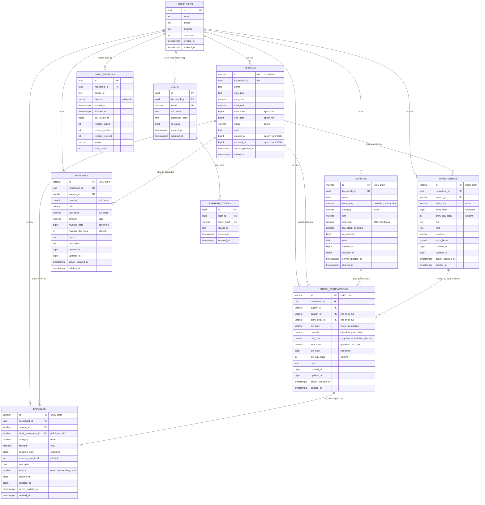

# Yêu cầu dữ liệu — Tầng cơ sở dữ liệu

**Module:** Lưu trữ (PostgreSQL là hệ thống chính + WatermelonDB là kho cục bộ)
**Bao phủ issue:** #6 (schema PostgreSQL), #7 (SQLAlchemy + Alembic), #8 (schema WatermelonDB), #9 (hình dạng dữ liệu của contract đồng bộ)
**Trạng thái:** Thiết kế đã chốt — cài đặt tại `backend/app/models/` và `mobile/src/db/schema.ts`
**Tác giả:** Lê Thành Thái (2212456) · Thiết kế có AI hỗ trợ (Claude)

---

## Mục lục

1. [Mục đích và phạm vi](#1-mục-đích-và-phạm-vi)
2. [Năm quy tắc ràng buộc mọi bảng](#2-năm-quy-tắc-ràng-buộc-mọi-bảng)
3. [Sơ đồ quan hệ thực thể (ERD)](#3-sơ-đồ-quan-hệ-thực-thể-erd)
4. [Các tập giá trị liệt kê](#4-các-tập-giá-trị-liệt-kê)
5. [Đặc tả từng bảng](#5-đặc-tả-từng-bảng)
6. [Yêu cầu metadata đồng bộ](#6-yêu-cầu-metadata-đồng-bộ)
7. [Song song kiểu dữ liệu PostgreSQL ↔ WatermelonDB](#7-song-song-kiểu-dữ-liệu-postgresql--watermelondb)
8. [Toàn vẹn tham chiếu khi đồng bộ](#8-toàn-vẹn-tham-chiếu-khi-đồng-bộ)
9. [Giá trị dẫn xuất và bất biến nghiệp vụ](#9-giá-trị-dẫn-xuất-và-bất-biến-nghiệp-vụ)
10. [Kế hoạch đánh index](#10-kế-hoạch-đánh-index)
11. [Yêu cầu truy vấn báo cáo](#11-yêu-cầu-truy-vấn-báo-cáo)
12. [Dữ liệu mẫu cho môi trường phát triển](#12-dữ-liệu-mẫu-cho-môi-trường-phát-triển)
13. [Các quyết định được ghi nhận](#13-các-quyết-định-được-ghi-nhận)

---

## 1. Mục đích và phạm vi

Tài liệu này là mô tả có thẩm quyền duy nhất về mô hình dữ liệu của AgriLog. Cả hai phía của hệ thống đều sinh ra từ đây:

| Bên sử dụng | Sản phẩm | Phải khớp với tài liệu này về |
|---|---|---|
| Backend | `backend/app/models/*.py` (SQLAlchemy 2.0) | tên bảng, tên cột, kiểu, ràng buộc, index |
| Backend | `backend/alembic/versions/*.py` | câu lệnh DDL hiện thực hoá những thứ trên |
| Mobile | `mobile/src/db/schema.ts` (WatermelonDB) | tên bảng, tên cột, kiểu phía JS |
| Mobile | `mobile/src/db/models/*.ts` | ánh xạ trường ↔ cột qua decorator `@field` / `@date` |
| Đồng bộ | `backend/app/services/sync_service.py` | tập bảng được đồng bộ và danh sách cột cho phép |

**Lệch tên trường giữa hai schema là nguyên nhân có xác suất cao nhất gây ra lỗi đồng bộ âm thầm trong đồ án này.** Vì vậy mọi cột dưới đây đều được đặc tả với tên snake_case *giống hệt nhau* ở cả hai phía. Không đổi tên, không camelCase trên đường truyền, và không có cột chỉ-thuộc-máy-chủ nào lọt vào payload đồng bộ.

### Trong phạm vi

Sáu bảng **được đồng bộ** (nằm trên thiết bị và đi qua ranh giới đồng bộ) và bốn bảng **chỉ ở máy chủ** (xác thực, kiểm toán, dữ liệu vận hành mà thiết bị không cần sở hữu).

### Cố ý nằm ngoài phạm vi

- Chia sẻ dữ liệu giữa nhiều nông hộ (dữ liệu mỗi hộ hoàn toàn cô lập, không có đường đọc chéo).
- Lưu ảnh / tệp đính kèm cho nhật ký. Đề cương không yêu cầu, và đồng bộ dữ liệu nhị phân sẽ làm sync engine phức tạp lên đáng kể. Ghi lại ở §13 như một mục tiêu không theo đuổi.
- Xoá vĩnh viễn dữ liệu phía máy chủ. Bia mộ (tombstone) được giữ suốt vòng đời đồ án.

---

## 2. Năm quy tắc ràng buộc mọi bảng

Năm quy tắc này không thương lượng theo từng bảng; chúng là lý do các cột ở §5 trông như vậy.

### R1 — Khoá chính do client sinh

`id` của mọi bản ghi được đồng bộ được tạo **trên thiết bị**, ngay lúc chèn, trước khi hỏi tới mạng.

- Kiểu: `VARCHAR(36)`, chứa chuỗi UUID v4 chữ thường.
- Bộ sinh mặc định của WatermelonDB tạo chuỗi ngẫu nhiên 16 ký tự. Ta ghi đè (`setGenerator`) để ID phía mobile là UUID theo RFC-4122, khớp với thứ mà script seed của backend và mọi client web tương lai tạo ra.
- **Vì sao:** đây là điều làm cho việc gửi lại một lần push trở nên an toàn. Bộ xử lý push upsert theo khoá mà client đã sở hữu, nên gửi lại đúng lô cũ sau khi rớt mạng không thể tạo dòng thứ hai. Với ID do máy chủ sinh, một lần push bị gián đoạn là thực sự nhập nhằng và trùng lặp trở nên không tránh khỏi.

### R2 — Hai đồng hồ, hai nhiệm vụ

Mọi bảng được đồng bộ mang cả mốc thời gian *của client* lẫn *của máy chủ*, và chúng không bao giờ làm thay việc của nhau.

| Cột | Đồng hồ | Dùng để |
|---|---|---|
| `updated_at` (BIGINT, epoch ms) | Thiết bị | So sánh ghi-sau-thắng khi xung đột; đi trong payload đồng bộ |
| `server_updated_at` (TIMESTAMPTZ) | PostgreSQL `clock_timestamp()` | Con trỏ pull; **không bao giờ** gửi cho client |

**Vì sao cần hai:** con trỏ pull phải đơn điệu và đáng tin. Điện thoại của nông dân bị sai ngày hệ thống không được phép ghi một bản ghi đóng dấu `2030-01-01` rồi tự làm mình vô hình với mọi lần pull về sau. Vì vậy con trỏ luôn là giờ máy chủ. Nhưng việc *giải quyết xung đột* thì thực sự muốn biết chỉnh sửa nào của con người xảy ra sau, tức là giờ thiết bị — nên nó ở lại đồng hồ client, kèm một cơ chế kẹp sai lệch (xem §6.4).

### R3 — Chỉ xoá mềm

Không dòng dữ liệu được đồng bộ nào bị `DELETE`. Xoá là đặt `deleted_at = clock_timestamp()` (giờ máy chủ) và đẩy `server_updated_at` lên.

**Vì sao:** xoá cứng là vô hình với thiết bị đang offline lúc đó. Endpoint pull phải trả lời được câu hỏi "sau con trỏ của bạn, những gì đã bị xoá?", và câu hỏi đó cần một bia mộ còn sống sót.

### R4 — Mọi dòng được đồng bộ đều thuộc về một nông hộ

Mọi bảng được đồng bộ đều có `household_id` không null. Mọi truy vấn ở tầng API, không ngoại lệ, đều lọc theo nông hộ đã xác thực. Không có endpoint nào có thể trả về dòng dữ liệu của hộ khác.

### R5 — Tiền và số lượng phải tường minh

- Tiền: `NUMERIC(16, 2)`, đơn vị **VND**. Mười sáu chữ số thừa sức bao doanh thu một vụ tính bằng đồng.
- Số lượng: `NUMERIC(14, 3)` — ba chữ số thập phân đủ cho `0.250 kg`, `12.500 L`, `1.750 bao`.
- Phía client cả hai đều thành `number` của JavaScript (IEEE-754 float64). Xem §7 để biết phân tích độ chính xác và hợp đồng làm tròn.

---

## 3. Sơ đồ quan hệ thực thể (ERD)



### Đọc hai quan hệ quan trọng nhất

**`DIARY_ENTRIES → STOCK_TRANSACTIONS` (1:N, khoá ngoại cho phép null).**
Một nhật ký ("phun thuốc 12/09") có thể tiêu thụ nhiều loại vật tư. Mỗi lần tiêu thụ là một dòng `stock_transactions` với `txn_type = 'out'` và `diary_entry_id` được đặt. Một lần xuất kho ghi thẳng từ màn hình vật tư thì để `diary_entry_id` trống. Nghĩa là chỉ có **một sổ cái kho duy nhất** thay vì một bảng "sử dụng" riêng phải giữ đồng bộ với nó — và đó là điều làm cho "hoàn kho" (Issue #25, #26) trở thành một thao tác có biên giới rõ ràng, kiểm thử được: đối chiếu tập dòng con của một dòng cha.

**`STOCK_TRANSACTIONS → EXPENSES` (1:0..1, khoá ngoại duy nhất).**
Mỗi lần tiêu thụ vật tư xuất phát từ nhật ký sẽ tự sinh đúng một dòng chi phí, mang `source = 'diary_auto'` và `stock_transaction_id` trỏ ngược lại. Ràng buộc duy nhất trên `stock_transaction_id` là thứ khiến Issue #29 trở nên idempotent: bộ sinh chỉ có thể tạo ra một chi phí cho mỗi giao dịch kho, nên chạy lại sau một lần thử đồng bộ không thể nhân đôi chi phí của nông dân.

---

## 4. Các tập giá trị liệt kê

Lưu dưới dạng `TEXT` kèm ràng buộc `CHECK`, **không** dùng kiểu `ENUM` của PostgreSQL.

**Vì sao TEXT + CHECK:** WatermelonDB không có kiểu enum, nên giá trị đi qua đường truyền dưới dạng chuỗi thuần bất kể thế nào. Enum gốc của PG lại cần một migration `ALTER TYPE` để mở rộng, khá vụng khi phải giữ đồng nhịp với phiên bản schema mobile. Ràng buộc `CHECK` cho toàn vẹn tương đương với một migration một dòng để nới rộng.

| Tập | Cột | Giá trị | Nhãn hiển thị |
|---|---|---|---|
| `work_type` | `diary_entries.work_type` | `land_prep` | Làm đất |
| | | `sowing` | Gieo/Trồng |
| | | `fertilizing` | Bón phân |
| | | `spraying` | Phun thuốc |
| | | `watering` | Tưới nước |
| | | `weeding` | Làm cỏ |
| | | `harvesting` | Thu hoạch |
| | | `other` | Khác |
| `supply_category` | `supplies.category` | `fertilizer` | Phân bón |
| | | `pesticide` | Thuốc BVTV |
| | | `seed` | Giống |
| | | `fuel` | Nhiên liệu |
| | | `tool` | Dụng cụ |
| | | `other` | Khác |
| `txn_type` | `stock_transactions.txn_type` | `in` | Nhập kho |
| | | `out` | Xuất kho |
| | | `adjust` | Điều chỉnh (kiểm kê) |
| `expense_category` | `expenses.category` | `supply` | Vật tư |
| | | `labor` | Nhân công |
| | | `machinery` | Máy móc |
| | | `transport` | Vận chuyển |
| | | `land_rent` | Thuê đất |
| | | `irrigation` | Thủy lợi |
| | | `other` | Khác |
| `expense_source` | `expenses.source` | `manual` | — |
| | | `diary_auto` | — |
| `season_status` | `seasons.status` | `planning` | Chuẩn bị |
| | | `active` | Đang canh tác |
| | | `harvested` | Đã thu hoạch |
| | | `closed` | Đã kết thúc |

Danh sách chuẩn nằm ở **đúng một chỗ mỗi phía** — `backend/app/models/enums.py` và `mobile/src/db/enums.ts` — và một test backend khẳng định mọi ràng buộc `CHECK` trong database thật khớp với tuple Python, nên một giá trị thêm ở phía này mà quên phía kia sẽ làm CI đỏ chứ không lọt ra sản phẩm.

---

## 5. Đặc tả từng bảng

Chú thích: **PK** khoá chính · **FK** khoá ngoại · **UK** duy nhất · **NN** không null · *(sync)* tham gia payload đồng bộ

### 5.1 `households` — chỉ máy chủ

Đơn vị thuê bao. Tạo một lần lúc đăng ký; thiết bị không bao giờ sửa.

| Cột | Kiểu | Ràng buộc | Ghi chú |
|---|---|---|---|
| `id` | `UUID` | PK, mặc định `gen_random_uuid()` | Máy chủ sinh — đăng ký vốn dĩ phải online |
| `name` | `TEXT` | NN | ví dụ "Hộ ông Lê Văn A" |
| `phone` | `VARCHAR(20)` | NULL | Chỉ để liên hệ, không phải định danh đăng nhập |
| `province` | `TEXT` | NULL | ví dụ "Lâm Đồng" |
| `commune` | `TEXT` | NULL | |
| `created_at` / `updated_at` | `TIMESTAMPTZ` | NN, mặc định `now()` | Giờ máy chủ — bảng này không đồng bộ |

### 5.2 `users` — chỉ máy chủ

| Cột | Kiểu | Ràng buộc | Ghi chú |
|---|---|---|---|
| `id` | `UUID` | PK, mặc định `gen_random_uuid()` | |
| `household_id` | `UUID` | FK → `households.id`, NN, `ON DELETE CASCADE` | |
| `email` | `VARCHAR(255)` | NN | Duy nhất qua index `uq_users_email_lower` trên `lower(email)`; tầng auth cũng chuẩn hoá về chữ thường trước khi ghi |
| `full_name` | `TEXT` | NN | |
| `password_hash` | `TEXT` | NN | bcrypt, cost 12. **Không bao giờ** rời khỏi máy chủ |
| `is_active` | `BOOLEAN` | NN, mặc định `TRUE` | |
| `created_at` / `updated_at` | `TIMESTAMPTZ` | NN, mặc định `now()` | |

**Yêu cầu:** một nông hộ có thể có nhiều hơn một người dùng (người nông dân và người con đã trưởng thành cùng ghi nhật ký từ hai điện thoại). Đây chính là kịch bản mà bài kiểm thử xung đột hai thiết bị ở Issue #40 khai thác, nên schema phải cho phép từ ngày đầu.

### 5.3 `refresh_tokens` — chỉ máy chủ

| Cột | Kiểu | Ràng buộc | Ghi chú |
|---|---|---|---|
| `id` | `UUID` | PK | |
| `user_id` | `UUID` | FK → `users.id`, NN, `ON DELETE CASCADE` | |
| `token_hash` | `VARCHAR(64)` | UK, NN | SHA-256 của token; token thô không bao giờ được lưu |
| `device_id` | `TEXT` | NULL | Định danh thiết bị ổn định do client sinh |
| `expires_at` | `TIMESTAMPTZ` | NN | 90 ngày |
| `revoked_at` | `TIMESTAMPTZ` | NULL | Đặt khi đăng xuất |
| `created_at` | `TIMESTAMPTZ` | NN, mặc định `now()` | |

**Yêu cầu xuất phát từ việc dùng ngoại tuyến:** access token sống 7 ngày, refresh token sống 90 ngày. Một thiết bị đã ở ngoài đồng không sóng ba tuần vẫn phải đồng bộ được khi kết nối lại, chứ không bị đá về màn hình đăng nhập trong khi đang giữ ba tuần công việc chưa đồng bộ.

### 5.4 `seasons` *(sync)*

| Cột | Kiểu | Ràng buộc | Ghi chú |
|---|---|---|---|
| `id` | `VARCHAR(36)` | PK | UUID do client sinh (R1) |
| `household_id` | `UUID` | FK → `households.id`, NN | R4 |
| `name` | `TEXT` | NN, độ dài 1–120 | "Vụ Đông Xuân 2026" |
| `crop_type` | `TEXT` | NN, độ dài 1–80 | "Lúa", "Cà chua", "Bắp cải" |
| `area_size` | `NUMERIC(10,3)` | NULL, `>= 0` | |
| `area_unit` | `VARCHAR(16)` | NN, mặc định `'sao'` | `sao` / `ha` / `m2` / `công` / `mẫu` |
| `start_date` | `BIGINT` | NN | Epoch ms |
| `end_date` | `BIGINT` | NULL | Epoch ms. NULL = vụ còn đang diễn ra |
| `status` | `VARCHAR(16)` | NN, mặc định `'active'`, CHECK enum | |
| `note` | `TEXT` | NULL | |
| *khối sync* | | | Xem §6.1 |

**Kiểm tra hợp lệ:** `end_date IS NULL OR end_date >= start_date`, được ép ở cả `CHECK` của bảng, schema Pydantic **và** biểu mẫu mobile. Ba tầng, vì một khoảng ngày sai sẽ âm thầm làm hỏng mọi truy vấn báo cáo lọc theo cửa sổ mùa vụ — và một lỗi báo cáo âm thầm tốn kém hơn nhiều so với một lỗi kiểm tra ồn ào.

### 5.5 `supplies` *(sync)*

| Cột | Kiểu | Ràng buộc | Ghi chú |
|---|---|---|---|
| `id` | `VARCHAR(36)` | PK | |
| `household_id` | `UUID` | FK, NN | |
| `name` | `TEXT` | NN, độ dài 1–120 | "Đạm Urê Phú Mỹ" |
| `name_key` | `VARCHAR(160)` | NN | `name` đã chuẩn hoá — xem bên dưới. **Chỉ máy chủ** |
| `category` | `VARCHAR(24)` | NN, CHECK enum | |
| `unit` | `VARCHAR(16)` | NN | `kg` / `L` / `bao` / `chai` / `gói` |
| `unit_cost` | `NUMERIC(16,2)` | NN, mặc định `0`, `>= 0` | Giá tham chiếu hiện tại, VND mỗi `unit` |
| `low_stock_threshold` | `NUMERIC(14,3)` | NN, mặc định `0`, `>= 0` | Kích hoạt cờ sắp hết hàng (Issue #24) |
| `is_archived` | `BOOLEAN` | NN, mặc định `false` | Ẩn khỏi danh sách chọn mà không xoá — xem §8.4 |
| `note` | `TEXT` | NULL | |
| *khối sync* | | | |

**Cố ý không có: `current_stock`.** Số lượng tồn **không bao giờ** là một cột được lưu. Nó luôn là `Σ(in) + Σ(adjust) − Σ(out)` trên các dòng `stock_transactions` chưa bị xoá.

**Vì sao:** một bộ đếm được lưu phải bị thay đổi bởi cả máy chủ lẫn mọi thiết bị offline, và hai thiết bị cùng trừ vào một bộ đếm đã cache khi đang offline sẽ tạo ra một con số đơn giản là sai sau khi đồng bộ — mà không có cách nào phát hiện. Suy ra từ một sổ cái chỉ-thêm nghĩa là hai thiết bị đóng góp hai dòng giao dịch độc lập, cả hai đồng bộ sạch sẽ, và tổng đúng theo cấu trúc. Đây là quyết định mô hình hoá dữ liệu trung tâm của module vật tư. Cái giá là một phép `SUM` mỗi lần đọc, được §10 đánh index và §11 cache ở tầng giao diện.

**`name_key`** là `name` đã qua `app.core.text.normalise_key` — chuẩn hoá NFC, cắt khoảng trắng, `casefold()`. Nó tồn tại vì **`lower()` của PostgreSQL hạ chữ theo collation của database**: với `C`, `lower('Đạm Urê Phú Mỹ')` trả về `'Đạm urê phú mỹ'` với chữ `Đ` nguyên vẹn, nên một index trên `lower(name)` vui vẻ chấp nhận cùng một vật tư hai lần. Hạ chữ trong Python rồi so sánh byte cho cùng kết quả trên mọi cụm bất kể nó được `initdb` thế nào. `name_key` là giá trị dẫn xuất, chỉ tồn tại phía máy chủ — không bao giờ đi trong payload đồng bộ. Phân tích đầy đủ: [Error_Postgres_Locale_Case_Folding.md](docs/troubleshooting/Error_Postgres_Locale_Case_Folding.md).

**Ràng buộc duy nhất:** `(household_id, name_key, unit) WHERE deleted_at IS NULL` — ngăn "Đạm Urê" bị tạo hai lần trên một thiết bị thành hai dòng tồn kho. Lưu ý nó *không* chống được phân vùng mạng (hai thiết bị cùng offline, cùng tạo, cùng push); §8.3 mô tả cách xử lý.

### 5.6 `stock_transactions` *(sync)*

Sổ cái kho chỉ-thêm.

| Cột | Kiểu | Ràng buộc | Ghi chú |
|---|---|---|---|
| `id` | `VARCHAR(36)` | PK | |
| `household_id` | `UUID` | FK, NN | |
| `supply_id` | `VARCHAR(36)` | FK → `supplies.id`, NN, DEFERRABLE | |
| `season_id` | `VARCHAR(36)` | FK → `seasons.id`, NULL, DEFERRABLE | Phân bổ chi phí; NULL khi nhập kho chung |
| `diary_entry_id` | `VARCHAR(36)` | FK → `diary_entries.id`, NULL, DEFERRABLE | Có giá trị ⟺ giao dịch xuất phát từ nhật ký |
| `txn_type` | `VARCHAR(8)` | NN, CHECK `in`/`out`/`adjust` | |
| `quantity` | `NUMERIC(14,3)` | NN, `> 0` với in/out | Luôn dương; chiều lấy từ `txn_type` |
| `unit_cost` | `NUMERIC(16,2)` | NN, mặc định `0`, `>= 0` | **Chụp ảnh** giá `supplies.unit_cost` tại thời điểm giao dịch |
| `total_cost` | `NUMERIC(16,2)` | NN, mặc định `0`, `>= 0` | `quantity × unit_cost`, tính rồi lưu |
| `txn_date` | `BIGINT` | NN | Epoch ms |
| `txn_day_local` | `INTEGER` | Cột sinh, STORED | Ngày lịch địa phương — xem §7.2 |
| `note` | `TEXT` | NULL | |
| *khối sync* | | | |

**Vì sao `unit_cost` được chụp ảnh chứ không join:** phân bón mua tháng 3 giá 12.000 ₫/kg và dùng vào tháng 9 phải được tính đúng bằng giá đã thực trả, không phải giá catalogue hôm nay. Join trực tiếp tới `supplies.unit_cost` sẽ âm thầm viết lại lịch sử tài chính của mọi mùa vụ đã qua mỗi lần nông dân cập nhật giá. `total_cost` cũng được lưu chứ không tính khi đọc, để một báo cáo có thể tái lập lại được.

**`quantity > 0` với `in` và `out`; `adjust` cho phép mọi giá trị khác 0** (một lần kiểm kê có thể điều chỉnh theo cả hai chiều). Diễn đạt thành:
`CHECK ((txn_type IN ('in','out') AND quantity > 0) OR (txn_type = 'adjust' AND quantity <> 0))`

### 5.7 `diary_entries` *(sync)*

| Cột | Kiểu | Ràng buộc | Ghi chú |
|---|---|---|---|
| `id` | `VARCHAR(36)` | PK | |
| `household_id` | `UUID` | FK, NN | |
| `season_id` | `VARCHAR(36)` | FK → `seasons.id`, NN, DEFERRABLE | Mọi nhật ký thuộc về một mùa vụ |
| `work_type` | `VARCHAR(24)` | NN, CHECK enum | |
| `entry_date` | `BIGINT` | NN | Epoch ms |
| `entry_day_local` | `INTEGER` | Cột sinh, STORED | |
| `title` | `TEXT` | NULL, độ dài ≤ 160 | Nhãn ngắn tuỳ chọn |
| `note` | `TEXT` | NULL | Ghi chú tự do |
| `weather` | `VARCHAR(32)` | NULL | `sunny` / `cloudy` / `rain` / `storm` / `windy` |
| `labor_hours` | `NUMERIC(6,2)` | NULL, `>= 0` | Thông tin tham khảo |
| *khối sync* | | | |

Việc tiêu thụ vật tư **không** lưu trên bảng này — nó nằm ở các dòng `stock_transactions` trỏ ngược qua `diary_entry_id` (§3). Biểu mẫu mobile trình bày chúng như một màn hình; mô hình dữ liệu giữ chúng là dòng cha cộng các dòng sổ cái con.

### 5.8 `expenses` *(sync)*

| Cột | Kiểu | Ràng buộc | Ghi chú |
|---|---|---|---|
| `id` | `VARCHAR(36)` | PK | |
| `household_id` | `UUID` | FK, NN | |
| `season_id` | `VARCHAR(36)` | FK → `seasons.id`, NN, DEFERRABLE | Chi phí phải quy được về một mùa vụ |
| `stock_transaction_id` | `VARCHAR(36)` | FK → `stock_transactions.id`, NULL, **UK**, DEFERRABLE | Có giá trị ⟺ `source = 'diary_auto'` |
| `category` | `VARCHAR(24)` | NN, CHECK enum | |
| `amount` | `NUMERIC(16,2)` | NN, `>= 0` | VND |
| `expense_date` | `BIGINT` | NN | Epoch ms |
| `expense_day_local` | `INTEGER` | Cột sinh, STORED | |
| `description` | `TEXT` | NULL | |
| `source` | `VARCHAR(16)` | NN, mặc định `'manual'`, CHECK `manual`/`diary_auto` | |
| *khối sync* | | | |

**Ràng buộc ghép:** `CHECK ((source = 'diary_auto') = (stock_transaction_id IS NOT NULL))` — hai trường không thể mâu thuẫn nhau.

**Index duy nhất:** `UNIQUE (stock_transaction_id) WHERE stock_transaction_id IS NOT NULL` — đây là bảo đảm idempotent cho Issue #29.

Các dòng tự sinh là **chỉ đọc trên giao diện**. Cách duy nhất để thay đổi chúng là sửa lượng vật tư trong nhật ký; biểu mẫu mobile khoá ô số tiền và hiển thị "Tự động từ nhật ký". Cho phép nông dân sửa tay một con số dẫn xuất sẽ khiến bộ sinh và giá trị đã lưu tách rời nhau mà không có cách hoà giải nào tại thời điểm đồng bộ.

### 5.9 `revenues` *(sync)*

| Cột | Kiểu | Ràng buộc | Ghi chú |
|---|---|---|---|
| `id` | `VARCHAR(36)` | PK | |
| `household_id` | `UUID` | FK, NN | |
| `season_id` | `VARCHAR(36)` | FK → `seasons.id`, NN, DEFERRABLE | |
| `quantity` | `NUMERIC(14,3)` | NULL, `>= 0` | Sản lượng bán, ví dụ `1250.000` |
| `unit` | `VARCHAR(16)` | NULL | `kg` / `tạ` / `tấn` / `bao` |
| `unit_price` | `NUMERIC(16,2)` | NULL, `>= 0` | VND mỗi đơn vị |
| `amount` | `NUMERIC(16,2)` | NN, `>= 0` | VND. Tổng có thẩm quyền |
| `revenue_date` | `BIGINT` | NN | Epoch ms |
| `revenue_day_local` | `INTEGER` | Cột sinh, STORED | |
| `buyer` | `TEXT` | NULL | "Thương lái Sáu Tâm" |
| `description` | `TEXT` | NULL | |
| *khối sync* | | | |

`amount` có thẩm quyền và luôn được lưu, kể cả khi đã có `quantity × unit_price`. Giao diện điền sẵn `amount` từ phép nhân nhưng cho phép nông dân ghi đè (giao dịch thật hay bị làm tròn xuống, trừ hao độ ẩm, hoặc trả một phần). Tính `amount` khi đọc sẽ âm thầm vứt bỏ con số họ thực sự nhận được.

### 5.10 `sync_sessions` — chỉ máy chủ, kiểm toán

Không đồng bộ. Được các endpoint sync ghi; được bài kiểm thử tải (Issue #39) và màn hình trạng thái đọc.

| Cột | Kiểu | Ràng buộc | Ghi chú |
|---|---|---|---|
| `id` | `UUID` | PK | |
| `household_id` | `UUID` | FK, NN | |
| `device_id` | `TEXT` | NULL | Từ header `X-Device-Id` |
| `direction` | `VARCHAR(8)` | NN, CHECK `pull`/`push` | |
| `started_at` | `TIMESTAMPTZ` | NN, mặc định `now()` | |
| `finished_at` | `TIMESTAMPTZ` | NULL | |
| `last_pulled_at` | `BIGINT` | NULL | Con trỏ client gửi lên |
| `records_pulled` | `INTEGER` | NN, mặc định `0` | |
| `records_pushed` | `INTEGER` | NN, mặc định `0` | |
| `records_rejected` | `INTEGER` | NN, mặc định `0` | Bên thua trong so sánh ghi-sau-thắng |
| `status` | `VARCHAR(8)` | NN, CHECK `ok`/`partial`/`error` | |
| `error_detail` | `TEXT` | NULL | |

Bảng này là cách để "độ trễ đồng bộ" và "tỷ lệ xung đột" thôi là tính từ trong báo cáo đồ án và trở thành những con số đo được.

---

## 6. Yêu cầu metadata đồng bộ

### 6.1 Khối cột đồng bộ phía máy chủ

Mọi bảng được đồng bộ đều có thêm năm cột này. Trong SQLAlchemy chúng đến từ một `SyncMixin` duy nhất nên không thể lệch nhau:

```
created_at         BIGINT       NOT NULL          -- epoch ms, đồng hồ THIẾT BỊ
updated_at         BIGINT       NOT NULL          -- epoch ms, đồng hồ THIẾT BỊ → so sánh LWW
server_updated_at  TIMESTAMPTZ  NOT NULL          -- đồng hồ MÁY CHỦ         → con trỏ pull
deleted_at         TIMESTAMPTZ  NULL              -- bia mộ (giờ máy chủ)
last_device_id     TEXT         NULL              -- thiết bị nào ghi bản này (kiểm toán)
```

`server_updated_at` do một **trigger database** duy trì, không phải mã ứng dụng:

```sql
CREATE OR REPLACE FUNCTION touch_server_updated_at() RETURNS trigger AS $$
BEGIN
  NEW.server_updated_at := clock_timestamp();
  RETURN NEW;
END;
$$ LANGUAGE plpgsql;
```

**Vì sao dùng trigger chứ không dùng `onupdate=` của SQLAlchemy:** script seed, một câu `UPDATE` gõ tay trong pgAdmin, và mọi công cụ quản trị tương lai đều đi vòng qua ORM. Bất kỳ lần ghi nào lọt khỏi ORM mà không đẩy con trỏ lên sẽ tạo ra một dòng dữ liệu vĩnh viễn vô hình với mọi thiết bị — loại lỗi đồng bộ tệ nhất, vì dữ liệu vẫn nằm trên máy chủ mà đơn giản là không bao giờ tới nơi. Ép trong database làm điều đó trở thành không thể biểu diễn được.

**Vì sao `clock_timestamp()` chứ tuyệt đối không phải `now()`:** `now()` chính là `transaction_timestamp()` — mọi câu lệnh trong một transaction nhận thời điểm *transaction bắt đầu*. Sync push cố ý áp cả lô trong một transaction (§6.6), nên với `now()` mọi dòng trong một lô push dài sẽ bị đóng dấu một thời điểm có thể đã nằm sau con trỏ mà một lần pull khác đã lưu — và những dòng đó sẽ không bao giờ được gửi đi nữa. `clock_timestamp()` đóng dấu từng dòng đúng lúc nó được ghi. Đây là một lỗi thật, bắt được bằng test hồi quy trước khi có bất kỳ client nào; phân tích đầy đủ ở [Error_Sync_Cursor_Transaction_Timestamp.md](docs/troubleshooting/Error_Sync_Cursor_Transaction_Timestamp.md).

### 6.2 Khối cột đồng bộ phía client

WatermelonDB tự duy trì các cột nội bộ của nó. Chúng **chỉ tồn tại cục bộ** và không bao giờ xuất hiện trong payload:

| Cột | Do ai duy trì | Ý nghĩa |
|---|---|---|
| `id` | Bộ sinh UUID của ta | Khoá chính (R1) |
| `_status` | WatermelonDB | `created` \| `updated` \| `synced` \| `deleted` — hàng đợi thay đổi chờ gửi |
| `_changed` | WatermelonDB | Danh sách trường đã sửa cục bộ, phân cách bằng dấu phẩy — dẫn dắt việc hợp nhất theo trường khi pull |
| `created_at` | Model của ta (`@readonly @date`) | Phản chiếu cột phía máy chủ |
| `updated_at` | Model của ta (`@date`) | Phản chiếu cột phía máy chủ |

`_status` là lý do AgriLog không cần bảng outbox: cơ sở dữ liệu cục bộ *chính là* hàng đợi. Huy hiệu đếm thay đổi chờ gửi trên thanh trạng thái (Issue #35) đúng nghĩa đen là `Q.where('_status', Q.notEq('synced'))` đếm trên sáu bảng được đồng bộ.

**Yêu cầu:** schema mobile **không được** khai báo `_status`, `_changed`, `server_updated_at`, `deleted_at`, `last_device_id` hay `name_key` như các cột trong `schema.ts`. Hai cái đầu do chính WatermelonDB thêm vào (khai báo lại sẽ gây xung đột schema), và những cái còn lại là mối quan tâm của máy chủ, không được phép đi vòng.

### 6.3 Danh sách cột được phép trong payload

Bộ tuần tự hoá pull phát ra, cho mỗi bản ghi: mọi cột nghiệp vụ ở §5, cộng `id`, `created_at`, `updated_at`. Nó **không phát ra gì khác**. Loại trừ cụ thể: `server_updated_at`, `deleted_at`, `last_device_id`, `household_id`, `name_key`, và các cột sinh `*_day_local` (tự động loại nhờ kiểm tra `column.computed`).

**Vì sao loại `household_id`:** client đã biết nông hộ của mình từ JWT, và mọi dòng nó có thể thấy đều thuộc về hộ đó. Gửi thêm sẽ thêm một cột vào sáu bảng WatermelonDB mà không mang thông tin gì, đồng thời tạo ra cơ hội thứ sáu để lệch schema. Máy chủ tự gắn lại khi push từ token đã xác thực — điều này cũng có nghĩa một client độc hại không thể ghi vào hộ khác bằng cách giả mạo trường đó, vì trường đó hoàn toàn không được đọc từ payload.

### 6.4 Kẹp sai lệch đồng hồ

Khi push, trước khi so sánh ghi-sau-thắng:

```
if incoming.updated_at > server_now_ms + 300_000:      # sớm hơn 5 phút
    incoming.updated_at = server_now_ms                 # kẹp lại
    ghi vào sync_sessions.error_detail
```

Không có bước này, một điện thoại cài sai ngày có thể đặt `updated_at` thành một giá trị xa trong tương lai và vĩnh viễn thắng mọi xung đột sau đó trên bản ghi ấy — chỉnh sửa của mọi thiết bị khác biến mất âm thầm, mãi mãi. Năm phút đủ rộng để hấp thụ sai lệch NTP thông thường và đủ hẹp để bắt được một chiếc đồng hồ sai năm.

### 6.5 Contract con trỏ pull

```
GET /sync/pull?lastPulledAt=<epoch_ms>&schemaVersion=<int>&migration=<json|null>
```

Hành vi máy chủ:

0. `detect_cursor := lastPulledAt − SYNC_CURSOR_SAFETY_MARGIN_MS` (2.000 ms) — xem bên dưới.
1. `now_ts := SELECT clock_timestamp()` — lấy **một lần**, ngay đầu request, trước khi đọc bất kỳ bảng nào.
2. Với mỗi bảng trong sáu bảng được đồng bộ:
   - `created` ← các dòng có `server_updated_at > detect_cursor AND deleted_at IS NULL AND created_at > lastPulledAt`
   - `updated` ← các dòng có `server_updated_at > detect_cursor AND deleted_at IS NULL AND created_at <= lastPulledAt`
   - `deleted` ← **chỉ chuỗi id** với `server_updated_at > detect_cursor AND deleted_at IS NOT NULL`
3. Trả về `{ "changes": {...}, "timestamp": <now_ts dạng epoch ms> }`.
4. `lastPulledAt = 0` (hoặc không có) nghĩa là khởi tạo toàn bộ: mọi dòng còn sống, tất cả nằm trong `created`.

**Vì sao lùi con trỏ một biên an toàn (bước 0):** một dòng được *đóng dấu* khi ghi nhưng chỉ *thấy được* khi transaction của nó commit. Một transaction ghi lúc T5 và commit lúc T8 là vô hình với lần pull chạy lúc T6 — lần pull đó sẽ lưu con trỏ T6 rồi bỏ qua dòng ấy mãi mãi. Lùi lại nhiều hơn transaction ghi dài nhất sẽ đóng khe hở đó. Gửi lại một dòng là vô hại vì client upsert theo ID nó tự sinh (R1). Biên phải lớn hơn thời lượng của lô push lớn nhất; bài kiểm thử tải ở Issue #39 sẽ đo và xem lại con số này.

**Vì sao phân loại `created`/`updated` dùng `lastPulledAt` gốc, không dùng con trỏ đã lùi:** biên an toàn chỉ mở rộng phạm vi *phát hiện*. Nếu phân loại cũng lùi theo thì mọi bản ghi được gửi lại vì an toàn sẽ đến dưới dạng `created` cho một bản ghi mà client **đã có** — WatermelonDB báo đó là lỗi. Dùng con trỏ gốc khiến các bản gửi lại rơi vào `updated`, đúng chỗ của chúng.

**Vì sao lấy `now_ts` trước khi đọc chứ không phải sau:** nếu lấy ở cuối, một dòng được thiết bị khác commit *trong lúc* đang đọc sẽ rơi vào trước con trỏ trả về và không bao giờ được kéo lại. Lấy trước nghĩa là dòng đó tệ nhất chỉ bị kéo hai lần — mà vì client áp dụng thay đổi bằng upsert, một lần pull trùng là thao tác rỗng. Thiết kế đánh đổi một dòng dư lấy điều bất khả: một dòng bị mất.

### 6.6 Contract push

```
POST /sync/push?lastPulledAt=<epoch_ms>
Body: { "changes": { "<bảng>": { "created": [...], "updated": [...], "deleted": ["id", ...] } } }
```

Hành vi máy chủ:

1. Mở **một** transaction cho toàn bộ lô.
2. Áp dụng các bảng theo đúng thứ tự phụ thuộc (§8.1).
3. Xử lý `created` và `updated` **giống hệt nhau** — cả hai là **upsert theo `id`** (R1). Một thiết bị đã tạo dòng, đã đồng bộ, rồi mất phản hồi sẽ gửi lại nó trong `created`; coi đó là lỗi sẽ khiến thiết bị đó kẹt vĩnh viễn.
4. Với từng dòng, so `incoming.updated_at` với `stored.updated_at`:
   - lớn hơn hẳn → áp dụng, đặt `last_device_id`, trigger đẩy `server_updated_at`
   - nhỏ hơn hoặc bằng → **từ chối riêng dòng đó**, tăng `records_rejected`, và báo lại trong phản hồi
5. Xoá đặt `deleted_at = clock_timestamp()` và idempotent (xoá một dòng đã xoá là thành công, không phải lỗi).
6. Commit. Gặp ngoại lệ ở mức lô thì rollback toàn bộ — client vẫn giữ mọi bản ghi ở `_status != 'synced'` và gửi lại. Không có trạng thái áp-dụng-một-nửa nào phải hoà giải.
7. Mỗi bản ghi có một **SAVEPOINT** riêng, để một vi phạm ràng buộc trên một dòng không làm hỏng phiên và kéo 499 dòng còn lại chết theo.

Phản hồi:

```jsonc
{
  "accepted": 143,
  "rejected": [
    { "table": "diary_entries", "id": "8f3c…", "reason": "stale_update",
      "server_updated_at": 1767312000000 }
  ],
  "timestamp": 1767312001234
}
```

Các lý do từ chối: `stale_update` · `missing_parent` · `foreign_record` · `unknown_table` · `invalid_record`.

**Vì sao báo cáo từ chối thay vì âm thầm bỏ qua:** một nông dân thua trong cuộc đua ghi-sau-thắng xứng đáng được thông báo, chứ không phải ba tuần sau mới phát hiện ghi chú chưa từng được lưu. Client hiển thị điều này trên giao diện trạng thái đồng bộ (Issue #35).

---

## 7. Song song kiểu dữ liệu PostgreSQL ↔ WatermelonDB

WatermelonDB hỗ trợ đúng ba kiểu cột: `string`, `number`, `boolean`. Mọi kiểu PostgreSQL phải ánh xạ vào một trong ba mà không mất mát.

| Khái niệm | PostgreSQL | WatermelonDB | Decorator | Phân tích mất mát |
|---|---|---|---|---|
| Khoá chính | `VARCHAR(36)` | *(`id` ngầm định)* | — | Không — chuỗi UUID cả hai phía |
| Khoá ngoại | `VARCHAR(36)` | `string` | `@relation` / `@field` | Không |
| Văn bản ngắn | `TEXT` / `VARCHAR(n)` | `string` | `@text` | Giới hạn độ dài do biểu mẫu ép phía client, cột ép phía máy chủ |
| Văn bản tự do | `TEXT` | `string` (`isOptional`) | `@text` | Không |
| Enum | `TEXT` + CHECK | `string` | `@field` | Ràng buộc chỉ ở máy chủ; client kiểm tra theo `enums.ts` |
| Tiền (VND) | `NUMERIC(16,2)` | `number` | `@field` | **Xem bên dưới** |
| Số lượng | `NUMERIC(14,3)` | `number` | `@field` | **Xem bên dưới** |
| Ngày nghiệp vụ | `BIGINT` (epoch ms) | `number` | `@date` | Không — đây đúng là cách WatermelonDB biểu diễn ngày |
| Mốc đồng bộ | `BIGINT` (epoch ms) | `number` | `@readonly @date` | Không |
| Mốc máy chủ | `TIMESTAMPTZ` | *(không lộ ra)* | — | Không bao giờ đi qua đường truyền (§6.3) |
| Boolean | `BOOLEAN` | `boolean` | `@field` | Không |

### 7.1 Hợp đồng độ chính xác `NUMERIC → number`

Đây là ánh xạ có mất mát duy nhất trong schema, nên nó được đặc tả thay vì mặc định.

Số của JavaScript là IEEE-754 float64: số nguyên chính xác tới 2⁵³ ≈ 9,007 × 10¹⁵, nhưng phân số thập phân như `0.1` không biểu diễn được chính xác.

**Tiền.** VND thực tế không có đơn vị nhỏ hơn; mọi khoản thật đều là số nguyên đồng. Giá trị lớn nhất hợp lý trong ứng dụng này — tổng doanh thu một vụ của một nông hộ — vào cỡ 10⁹ ₫, tức là thấp hơn trần số nguyên chính xác mười một bậc độ lớn. Vậy tiền là **chính xác tuyệt đối** trong float64 với mọi giá trị ứng dụng này sẽ chứa. Thang `NUMERIC(16,2)` tồn tại để hấp thụ những trường hợp hiếm có `.50` và để cột trung thực, không phải vì mong đợi phân số.

**Số lượng.** `12.5 kg` biểu diễn được; `0.1 + 0.2 = 0.30000000000000004` là cái bẫy kinh điển. Hợp đồng:

- Client làm tròn mọi số lượng về 3 chữ số thập phân trước khi ghi: `Math.round(q * 1000) / 1000`.
- Máy chủ làm tròn mọi số lượng nhận vào về 3 chữ số trước khi lưu: `Decimal(str(q)).quantize(Decimal('0.001'), ROUND_HALF_UP)`.
- Mọi phép tính phía máy chủ (mức tồn, tổng hợp chi phí) dùng `Decimal` của Python, không bao giờ dùng `float`.
- Một test backend khẳng định vòng tròn ổn định: ghi `0.1`, `0.2`, `0.3`, cộng lại, và khẳng định đúng bằng `0.600`.

Vì hai phía làm tròn giống hệt nhau tại ranh giới, giá trị lưu trên thiết bị và trên máy chủ giống nhau từng bit, và ghi-sau-thắng không bao giờ kích hoạt nhầm trên một giá trị chỉ *trông có vẻ* khác.

Toàn bộ hợp đồng này nằm ở một chỗ: `backend/app/core/numeric.py`.

### 7.2 Xử lý ngày tháng

Ngày nghiệp vụ (`start_date`, `entry_date`, `txn_date`, `expense_date`, `revenue_date`) được lưu dưới dạng `BIGINT` epoch mili-giây trong PostgreSQL thay vì `DATE` hay `TIMESTAMPTZ`.

**Vì sao:** decorator `@date` của WatermelonDB lưu epoch ms. Lưu `DATE` phía máy chủ sẽ đòi hỏi một phép chuyển đổi ở cả hai đầu của mỗi lần đồng bộ, và mỗi phép chuyển đổi là một chỗ có thể áp múi giờ không nhất quán — triệu chứng kinh điển là một nhật ký ghi lúc 20 giờ ngày 12 lại hiện ra ở ngày 13 sau khi đồng bộ. Epoch ms là cùng một số nguyên ở mọi nơi và không cần diễn giải gì để đi vòng.

**Cái giá** là việc gom nhóm theo ngày trong SQL không miễn phí. Việt Nam là UTC+7 quanh năm không có giờ tiết kiệm ánh sáng, nên ngày lịch địa phương là phép số học nguyên chính xác:

```sql
-- chỉ số ngày địa phương, bất biến → đánh index được
ALTER TABLE expenses ADD COLUMN expense_day_local INTEGER
  GENERATED ALWAYS AS (((expense_date + 25200000) / 86400000)::INTEGER) STORED;
```

`25200000` là 7 giờ tính bằng mili-giây. Cột sinh tương tự được thêm cho `revenues.revenue_date`, `diary_entries.entry_date` và `stock_transactions.txn_date`.

Hằng số offset nằm ở `backend/app/core/config.py` dưới tên `APP_TZ_OFFSET_MS` và ở `mobile/src/utils/date.ts` dưới tên `TZ_OFFSET_MS`, để việc gom nhóm phía client và phía máy chủ cho ra cùng những nhóm giống nhau. Nếu ứng dụng được triển khai ngoài một múi giờ có offset cố định thì đây chính là giả định bị phá vỡ — ghi ở §13.

Báo cáo gom theo tuần và tháng được thực hiện trong Python từ các cột `*_day_local` này, chứ không phải bằng SQL. Xem §11.

---

## 8. Toàn vẹn tham chiếu khi đồng bộ

### 8.1 Thứ tự áp dụng các bảng

Một lô đồng bộ là một tập bảng phẳng, nhưng các dòng có phụ thuộc. Cả push (máy chủ) và pull (client) đều áp dụng theo thứ tự:

```
1. seasons              (chỉ phụ thuộc households)
2. supplies             (chỉ phụ thuộc households)
3. diary_entries        (→ seasons)
4. stock_transactions   (→ supplies, seasons, diary_entries)
5. expenses             (→ seasons, stock_transactions)
6. revenues             (→ seasons)
```

Xoá được áp dụng theo thứ tự **ngược lại**, để không bao giờ đặt bia mộ cho một dòng cha trong khi con của nó còn sống.

### 8.2 Ràng buộc trì hoãn

Mọi khoá ngoại giữa các bảng được đồng bộ đều khai báo `DEFERRABLE INITIALLY DEFERRED`.

**Vì sao:** ngay cả với thứ tự ở §8.1, một lô đơn lẻ vẫn có thể chứa một dòng `stock_transactions` mà `diary_entry_id` của nó trỏ tới một nhật ký nằm trong *cùng* lô đó. Thứ tự xử lý được trường hợp này. Cái mà thứ tự không xử lý được là một vi phạm `RESTRICT` phát sinh giữa lô trên một dòng mà một câu lệnh sau đó trong cùng transaction sẽ sửa. Trì hoãn kiểm tra tới lúc `COMMIT` nghĩa là lô được kiểm tra như một tổng thể — đó mới là ngữ nghĩa đúng, vì lô *chính là* đơn vị nguyên tử.

### 8.3 Chính sách với dòng mồ côi và dòng trùng

| Tình huống | Chính sách |
|---|---|
| Dòng con tới nhưng dòng cha chưa có (cha còn nằm ở thiết bị khác) | Từ chối **chỉ dòng con**, báo `reason: "missing_parent"`. Client sẽ gửi lại ở chu kỳ sau, lúc đó dòng cha thường đã tới. Lô không bị đánh trượt. |
| Dòng cha bị xoá mềm, dòng con còn sống | Máy chủ lan xoá mềm xuống các dòng con trong cùng transaction (xem §8.4) |
| Cùng một vật tư được tạo độc lập trên hai thiết bị offline | Cả hai dòng đồng bộ lên và cùng tồn tại thành hai mục tồn kho. Điều này *đúng* — âm thầm gộp hai dòng mà con người có thể chủ ý tạo riêng còn tệ hơn là hiển thị cả hai. Giao diện đưa ra gợi ý "có thể trùng" ở màn hình tồn kho; việc gộp là hành động thủ công, tường minh. Ghi nhận như một hạn chế đã biết trong báo cáo. |
| Dòng được push cho một nông hộ mà JWT không sở hữu | Từ chối riêng dòng đó với `reason: "foreign_record"`. Trùng UUID do client sinh là cực kỳ khó xảy ra, nên trường hợp này gần như luôn có nghĩa một thiết bị đã được đăng ký lại sang hộ khác. |

### 8.4 Quy tắc lan truyền khi xoá

| Cha | Con | Khi xoá mềm |
|---|---|---|
| `seasons` | `diary_entries`, `expenses`, `revenues` | Lan xoá mềm |
| `seasons` | `stock_transactions` **có** `diary_entry_id` | Lan xoá mềm **+ hoàn kho**. Công việc không xảy ra thì phân bón không được dùng — cùng quy tắc với việc xoá một nhật ký (bất biến I3). |
| `seasons` | `stock_transactions` **không có** `diary_entry_id` | **Gỡ liên kết, không xoá.** `season_id` được đặt về NULL và dòng sống sót. Đây là những lần mua thật được ghi vào mùa vụ; xoá chúng sẽ xoá một giao dịch đã thực sự xảy ra và âm thầm thay đổi số tồn của một vật tư mà nông dân vẫn đang có trong nhà. Sổ cái là chỉ-thêm (D1) — mùa vụ bị xoá không phải lý do để viết lại nó. |
| `diary_entries` | `stock_transactions` (có `diary_entry_id`) | Lan xoá mềm **+ hoàn kho** (§9.2) |
| `stock_transactions` | `expenses` (qua `stock_transaction_id`) | Lan xoá mềm |
| `supplies` | `stock_transactions` | **Chặn.** Một vật tư đã có lịch sử giao dịch không thể xoá — API trả về 409 và hướng người dùng sang `is_archived`. Hai lý do, đều liên quan tới *thiết bị khác*: bia mộ khiến WatermelonDB xoá dòng đó khỏi mọi máy, nên nhật ký vụ trước sẽ hiển thị tên vật tư trống; và các dòng sổ cái mang giá mà mùa vụ đã qua được hạch toán, nên gỡ bỏ mục danh mục chúng trỏ tới là viết lại lịch sử đó. Một vật tư đã lưu trữ vẫn đồng bộ bình thường và vẫn giữ sổ cái của nó. |
| `households` | tất cả | `ON DELETE CASCADE` cứng (chỉ khi đóng tài khoản; không truy cập được từ ứng dụng) |

---

## 9. Giá trị dẫn xuất và bất biến nghiệp vụ

Đây là những tính chất phải đúng sau **mọi** chuỗi thao tác, dù online hay offline, và là thứ mà các bộ test ở Issue #25, #26, #29, #40 khẳng định.

### 9.1 Mức tồn kho

```
on_hand(vật_tư) = Σ quantity WHERE txn_type='in'     AND deleted_at IS NULL
                + Σ quantity WHERE txn_type='adjust' AND deleted_at IS NULL
                − Σ quantity WHERE txn_type='out'    AND deleted_at IS NULL
```

- **I1.** Được tính giống hệt nhau bởi `supply_service.stock_levels()` (dùng `Decimal` của Python) và bởi hàm rút gọn `stockLevel()` phía mobile. Một bộ dữ liệu mẫu 20 giao dịch hỗn hợp phải cho kết quả giống nhau từng byte ở cả hai phía.
- **I2.** `on_hand` **được phép âm** — nông dân có thể ghi dùng phân bón mà quên ghi lúc mua. Ứng dụng cảnh báo nhưng không bao giờ chặn. Chặn sẽ buộc nông dân bỏ luôn bản ghi nhật ký, mà thiếu nhật ký còn tệ hơn một con số âm họ có thể sửa sau. Con số âm chính là lời nhắc nhìn thấy được để ghi bổ sung lần nhập kho còn thiếu.

### 9.2 Hoàn kho (Issue #25, #26)

Gọi `D` là một nhật ký và `T(D)` là tập `stock_transactions` con của nó (`diary_entry_id = D.id`, `txn_type='out'`).

**Khi sửa lượng vật tư của D** — service đối chiếu `T(D)` với danh sách được gửi lên, khớp theo `supply_id`:

| Trường hợp | Hành động |
|---|---|
| Vật tư có trong danh sách mới, không có trong cũ | Chèn giao dịch `out` mới + chi phí `diary_auto` của nó |
| Có ở cả hai, số lượng đổi | Cập nhật `quantity`, tính lại `total_cost`, cập nhật `amount` của chi phí liên kết |
| Có ở cả hai, số lượng không đổi | **Không ghi gì** (không đẩy `updated_at` — một lần ghi rỗng sẽ tạo ra xung đột giả cho thiết bị khác) |
| Có trong danh sách cũ, không có trong mới | Xoá mềm giao dịch + chi phí liên kết → vật tư quay lại kho |

Trường hợp thứ ba quan trọng hơn vẻ ngoài của nó. Đây không phải tối ưu hoá. Chạm vào một dòng sẽ đẩy `updated_at`, mà `updated_at` là thứ dẫn dắt ghi-sau-thắng. Ghi đè một dòng không thay đổi sẽ **chế tạo ra một xung đột** với thiết bị khác đang sửa hợp lệ chính dòng đó, và chỉnh sửa của thiết bị kia sẽ thua.

**Khi xoá D:** xoá mềm mọi dòng trong `T(D)` và mọi chi phí liên kết với chúng.

- **I3.** Với bất kỳ nhật ký nào, chuỗi `tạo → sửa → xoá` đưa `on_hand` của mọi vật tư bị chạm tới về **đúng bằng** giá trị trước khi tạo. Khẳng định bằng so sánh `Decimal` tuyệt đối, không phải so sánh xấp xỉ.
- **I4.** Việc hoàn kho là idempotent — áp dụng hai lần (như một lần thử lại đồng bộ sẽ làm) cho ra cùng trạng thái với áp dụng một lần.
- **I5.** Bản cài đặt phía mobile chạy hoàn toàn bên trong một khối `writer` của WatermelonDB, nên ứng dụng sập giữa chừng không thể để lại tồn kho hoàn một nửa.

### 9.3 Chi phí tự sinh (Issue #29)

Với mỗi dòng `stock_transactions` có `txn_type = 'out'` **và** `diary_entry_id IS NOT NULL`, tồn tại đúng một chi phí với:

```
expenses.stock_transaction_id = txn.id
expenses.source               = 'diary_auto'
expenses.category             = 'supply'
expenses.amount               = txn.total_cost
expenses.season_id            = txn.season_id  (dự phòng: mùa vụ của nhật ký)
expenses.expense_date         = txn.txn_date
```

- **I6.** Được đảm bảo về mặt cấu trúc bởi index duy nhất trên `stock_transaction_id` — bất biến này không thể bị vi phạm kể cả bởi một service có lỗi, vì database từ chối dòng thứ hai.
- **I7.** Một lần xuất kho ghi thẳng từ màn hình vật tư (`diary_entry_id IS NULL`) sinh **không** chi phí nào. Lý do: giao dịch đó là kiểm kê hoặc luân chuyển, và tiền đã được ghi nhận là chi phí lúc mua vật tư. Tự sinh ở đây sẽ tính hai lần.
- **I8.** `amount` do máy chủ tính và do client tính với cùng đầu vào phải bằng nhau tới từng đơn vị tiền, điều này suy ra từ hợp đồng làm tròn ở §7.1.

### 9.4 Tổng kết tài chính mùa vụ

```
total_cost    = Σ expenses.amount  WHERE season_id = S AND deleted_at IS NULL
total_revenue = Σ revenues.amount  WHERE season_id = S AND deleted_at IS NULL
profit        = total_revenue − total_cost
```

- **I9.** Vì tiêu thụ vật tư đã trở thành chi phí `diary_auto`, `total_cost` đã bao gồm nó rồi. Không có bước "cộng thêm chi phí vật tư" riêng — tính hai lần là điều không thể về mặt cấu trúc.
- **I10.** `profit` không bao giờ được lưu. Lưu nó sẽ đòi hỏi vô hiệu hoá cache ở mỗi trong số rất nhiều lần ghi có thể ảnh hưởng tới nó, trên hai cơ sở dữ liệu, mà một trong hai thường xuyên offline.

---

## 10. Kế hoạch đánh index

### 10.1 Bắt buộc — đường đồng bộ

Trên **mọi** bảng được đồng bộ:

```sql
CREATE INDEX ix_<bảng>_sync ON <bảng> (household_id, server_updated_at);
```

Đây là index duy nhất mà truy vấn pull dùng, và truy vấn pull là truy vấn nóng nhất, nhạy cảm độ trễ nhất của hệ thống. Thứ tự cột quan trọng: `household_id` trước (so bằng) rồi `server_updated_at` (so khoảng).

### 10.2 Màn hình danh sách và chi tiết

```sql
CREATE INDEX ix_seasons_household_start  ON seasons (household_id, start_date DESC)
    WHERE deleted_at IS NULL;
CREATE INDEX ix_diary_season_date        ON diary_entries (season_id, entry_date DESC)
    WHERE deleted_at IS NULL;
CREATE INDEX ix_diary_worktype           ON diary_entries (household_id, work_type, entry_date DESC)
    WHERE deleted_at IS NULL;
CREATE INDEX ix_supplies_household_cat   ON supplies (household_id, category, name)
    WHERE deleted_at IS NULL;
CREATE INDEX ix_supplies_active          ON supplies (household_id, category, name)
    WHERE deleted_at IS NULL AND is_archived = false;
CREATE INDEX ix_stock_supply_date        ON stock_transactions (supply_id, txn_date DESC)
    WHERE deleted_at IS NULL;
CREATE INDEX ix_stock_diary              ON stock_transactions (diary_entry_id)
    WHERE deleted_at IS NULL AND diary_entry_id IS NOT NULL;
CREATE INDEX ix_stock_season_type        ON stock_transactions (season_id, txn_type)
    WHERE deleted_at IS NULL;
CREATE INDEX ix_expenses_season_date     ON expenses (season_id, expense_date)
    WHERE deleted_at IS NULL;
CREATE INDEX ix_revenues_season_date     ON revenues (season_id, revenue_date)
    WHERE deleted_at IS NULL;
```

Index bộ phận (`WHERE deleted_at IS NULL`) được dùng xuyên suốt vì mọi truy vấn ứng dụng đều loại bia mộ, còn bản thân bia mộ chỉ được đường đồng bộ đọc — mà đường đó dùng index ở §10.1. Nhờ vậy các index ứng dụng không phình to theo số dòng chết.

### 10.3 Ràng buộc duy nhất

```sql
CREATE UNIQUE INDEX uq_expense_per_stock_txn ON expenses (stock_transaction_id)
    WHERE stock_transaction_id IS NOT NULL;

-- name_key, KHÔNG phải lower(name): xem §5.5 và
-- docs/troubleshooting/Error_Postgres_Locale_Case_Folding.md
CREATE UNIQUE INDEX uq_supply_key_unit       ON supplies (household_id, name_key, unit)
    WHERE deleted_at IS NULL;

CREATE UNIQUE INDEX uq_users_email_lower     ON users (lower(email));
```

### 10.4 Index phía WatermelonDB

WatermelonDB hỗ trợ `isIndexed: true` cho từng cột. Áp dụng cho: mọi khoá ngoại `*_id`, cộng `entry_date`, `txn_date`, `expense_date`, `revenue_date`, `work_type` và `txn_type` — những cột mà màn hình danh sách ngoại tuyến lọc và sắp xếp theo. Dữ liệu trên thiết bị nhỏ (một nông hộ tích luỹ cỡ 10³–10⁴ dòng qua một mùa vụ), nên chi phí khuếch đại ghi là không đáng kể so với việc giữ cho danh sách cuộn mượt trên điện thoại Android cấu hình thấp.

---

## 11. Yêu cầu truy vấn báo cáo

Ba biểu đồ bắt buộc, kèm hợp đồng dữ liệu mỗi biểu đồ cần. Cả ba phải tính được **chỉ từ dữ liệu WatermelonDB cục bộ** (Issue #47) và đồng thời được lộ ra thành các endpoint backend (Issue #42) phải trả về cùng những con số với cùng bộ dữ liệu.

**Kiến trúc:** gộp trong SQL, chia nhóm trong Python. SQL gom theo các cột `*_day_local` đã lưu — đã đánh index, đã mang offset UTC+7 cố định — giữ quy tắc "đây là ngày nào" ở đúng một chỗ. Gộp ngày thành tuần và tháng, cùng việc tạo ra các nhóm rỗng ở giữa, là phép số học lịch mà SQL diễn đạt tệ còn Python diễn đạt rõ ràng. Một mùa vụ dài nhất vài trăm ngày, nên số dòng tới Python là không đáng kể.

### 11.1 Thu chi theo thời gian — `GET /reports/income-expense`

Tham số: `season_id` (bắt buộc), `granularity` = `day` | `week` | `month` (mặc định `month`).

```jsonc
{ "season_id": "…", "season_name": "Vụ Đông Xuân 2026", "granularity": "month",
  "buckets": [ { "period": "2026-09", "revenue": "0.00", "expense": "4250000.00",
                 "profit": "-4250000.00" } ],
  "totals": { "revenue": "62000000.00", "expense": "21400000.00",
              "profit": "40600000.00" } }
```

Yêu cầu: các nhóm phải **dày đặc** — một tháng không có hoạt động bên trong cửa sổ mùa vụ vẫn xuất hiện với giá trị 0. Chuỗi thưa khiến biểu đồ đường nói dối về hình dạng chi tiêu.

Khoảng thời gian là cửa sổ đã khai báo của mùa vụ, được mở rộng để bao mọi hoạt động ghi nhận ngoài cửa sổ đó — nếu không, tổng của biểu đồ sẽ không khớp với tổng kết mùa vụ.

### 11.2 Vật tư tiêu thụ theo loại — `GET /reports/supply-consumption`

Tham số: `season_id` (tuỳ chọn — bỏ trống để tính mọi mùa vụ), `group_by` = `category` | `supply` (mặc định `category`).

```jsonc
{ "group_by": "category",
  "items": [ { "key": "fertilizer", "label": "Phân bón",
               "quantity": "340.500", "unit": null, "unit_mixed": true,
               "total_cost": "8900000.00", "share_pct": "41.6",
               "transaction_count": 12 } ],
  "total_cost": "21400000.00" }
```

Yêu cầu: chỉ gộp `txn_type = 'out'`. Cờ `unit_mixed` báo rằng nhóm này cộng gộp cả `kg` lẫn `L` — khi đó biểu đồ phải ghi nhãn trục theo **chi phí**, không theo số lượng, vì cộng ki-lô-gam với lít là vô nghĩa. Đây là lý do `total_cost` mới là thước đo chính, và `unit` được để trống trong trường hợp này.

### 11.3 So sánh lợi nhuận giữa các mùa vụ — `GET /reports/season-comparison`

Tham số: `limit` (mặc định 10), `status` (bộ lọc tuỳ chọn).

```jsonc
{ "seasons": [ { "season_id": "…", "name": "Vụ Đông Xuân 2026", "crop_type": "Lúa",
                 "status": "closed", "start_date": 1767225600000,
                 "revenue": "62000000.00", "expense": "21400000.00",
                 "profit": "40600000.00", "margin_pct": "65.5" } ],
  "best_season_id": "…", "worst_season_id": "…" }
```

Yêu cầu: hiển thị đúng với **đúng một** mùa vụ (Issue #46) — một biểu đồ một cột, không phải trạng thái lỗi. Mùa vụ chưa có dữ liệu vẫn xuất hiện ở mức 0 chứ không biến mất; nông dân so sánh cần thấy vụ họ vừa tạo.

### 11.4 Test song song

Một test backend gieo một bộ dữ liệu cố định, gọi các endpoint, và khẳng định JSON khớp với một *golden fixture* (`backend/tests/fixtures/reports_golden.json`). **Cùng file fixture đó** được commit để bộ test Jest phía mobile khẳng định các hàm rút gọn cục bộ của nó. Hai bộ test đọc chung một file chính là điều biến "biểu đồ hiện cùng con số khi ngoại tuyến và trực tuyến" thành một tính chất được kiểm chứng thay vì một mong đợi.

---

## 12. Dữ liệu mẫu cho môi trường phát triển

`python -m app.seed` tạo một bộ dữ liệu thực tế. Tính thực tế là quan trọng: một biểu đồ báo cáo với ba dòng dữ liệu không chứng minh được gì về cách nó hiển thị với dữ liệu một mùa vụ thật.

| Thực thể | Số lượng | Ghi chú |
|---|---|---|
| Nông hộ | 1 | "Hộ ông Lê Văn A", Lâm Đồng |
| Người dùng | 2 | `demo@agrilog.vn` / `demo1234`, cộng một người thứ hai cho bài kiểm thử hai thiết bị |
| Mùa vụ | 3 | Một `closed` (có lãi), một `harvested` (lỗ), một `active` |
| Vật tư | 12 | Trải đủ sáu nhóm, đơn vị hỗn hợp |
| Giao dịch kho | ~180 | Hỗn hợp nhập/xuất thực tế qua 6 tháng |
| Nhật ký | ~90 | Đủ mọi loại công việc, phân bố thực tế (phun thuốc theo đợt) |
| Chi phí | ~110 | ~60 % `diary_auto`, ~40 % `manual` |
| Doanh thu | 8 | Nhiều lần bán từng phần trong mỗi vụ |

Tuỳ chọn: `--reset` xoá và dựng lại; `--large` mở rộng tới 5.000+ dòng cho bài kiểm thử tải đồng bộ (Issue #39) và đo hiệu năng ảo hoá danh sách (Issue #50).

**Tài khoản và mùa vụ được tạo qua chính tầng service của ứng dụng**, không phải bằng cách chèn dòng trực tiếp — seed bằng một đường code song song chính là cách một script seed tạo ra những dòng dữ liệu mà bản thân ứng dụng không bao giờ tạo được. Phần nhật ký, giao dịch kho và chi phí sẽ được bổ sung khi các service tương ứng hoàn thiện, vì chúng phải đi qua logic hoàn kho và tự sinh chi phí để thoả các bất biến ở §9.

---

## 13. Các quyết định được ghi nhận

Những giả định trong thiết kế này cần được nêu tường minh trong báo cáo đồ án, và là những điểm mà người phản biện có thể chất vấn một cách hợp lý.

| # | Quyết định | Lý do | Điều gì hỏng nếu sai |
|---|---|---|---|
| D1 | Tồn kho suy ra từ sổ cái, không bao giờ lưu thành bộ đếm | Hai thiết bị offline cùng trừ một bộ đếm đã cache tạo ra con số sai không phát hiện được | Không có — cách này chắc chắn an toàn hơn; cái giá chỉ là một phép `SUM` mỗi lần đọc |
| D2 | Ghi-sau-thắng theo `updated_at` của thiết bị, ở mức toàn bản ghi | Hợp nhất theo từng trường ở máy chủ sẽ cần vector phiên bản cho từng trường — thực chất là lãnh địa CRDT, quá tầm với phạm vi này | Hai chỉnh sửa đồng thời vào hai trường *khác nhau* của một bản ghi thì mất một bên. Giảm nhẹ: các lần từ chối được báo cáo chứ không âm thầm; và việc hợp nhất phía client khi pull *thì có* theo từng trường |
| D3 | Ngày nghiệp vụ lưu dạng epoch-ms BIGINT | Song song chính xác với WatermelonDB; không có phép chuyển múi giờ nào tại ranh giới đồng bộ | Gom nhóm theo ngày trong SQL cần hằng số offset UTC+7 (§7.2) |
| D4 | Cố định UTC+7, không có giờ mùa hè | Việt Nam không áp dụng DST từ 1975 | Triển khai ngoài Việt Nam sẽ phải làm lại các cột sinh |
| D5 | Vật tư trùng từ hai thiết bị offline cùng tồn tại | Tự động gộp hai dòng mà con người có thể chủ ý tạo riêng là kiểu hỏng tệ hơn | Nông dân thấy hai dòng tồn kho và phải gộp thủ công |
| D6 | Không đồng bộ ảnh / tệp đính kèm | Đồng bộ dữ liệu nhị phân là một hệ thống con đáng kể; đề cương không yêu cầu | Mục tiêu không theo đuổi, nêu rõ trong báo cáo |
| D7 | Chi phí `diary_auto` là chỉ đọc trên giao diện | Một giá trị dẫn xuất bị sửa tay sẽ tách rời khỏi bộ sinh mà không có đường hoà giải | Nông dân phải sửa nhật ký để thay đổi chi phí |
| D8 | Access token 7 ngày / refresh 90 ngày | Thiết bị offline nhiều tuần vẫn phải đồng bộ được mà không bị hỏi đăng nhập | Token sống lâu hơn là cửa sổ rủi ro lớn hơn nếu mất điện thoại. Chấp nhận: dữ liệu là hồ sơ canh tác của một hộ, và refresh token thu hồi được |
| D9 | Cho phép tồn kho âm kèm cảnh báo | Chặn sẽ buộc nông dân bỏ luôn bản ghi nhật ký; thiếu nhật ký tệ hơn một con số sửa được | Báo cáo có thể tạm hiển thị số tồn âm |
| D10 | Ứng dụng kết nối bằng role `agrilog`, không phải superuser `postgres` | Ứng dụng chỉ cần sở hữu hai database của mình | Chạy bằng superuser biến một lỗi injection từ vấn đề một database thành chiếm toàn cụm |

---

*Nhật ký thay đổi: mọi chỉnh sửa tài liệu này phải đi kèm một migration Alembic tương ứng, một mục `schemaMigrations` tương ứng của WatermelonDB, và một lần tăng `version` của schema mobile. Ba thứ đó đi cùng nhau, nếu không đồng bộ sẽ hỏng.*
