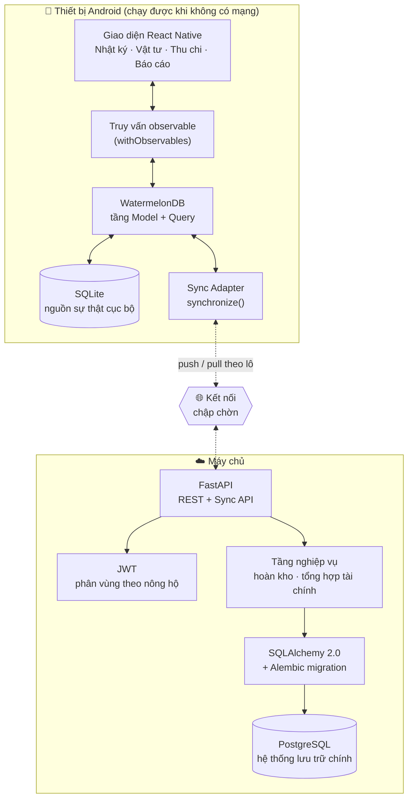

# AgriLog

> **Ứng dụng quản lý nhật ký canh tác cây ngắn ngày, vật tư và chi phí nông nghiệp cho nông hộ**
> Ứng dụng di động ưu tiên ngoại tuyến (offline-first), giúp nông hộ ghi nhật ký công việc đồng ruộng, theo dõi tồn kho vật tư và tính chi phí / doanh thu / lợi nhuận theo từng mùa vụ — **hoạt động đầy đủ khi mất mạng hoàn toàn** và **tự động đồng bộ hai chiều** khi có kết nối trở lại.

Đồ án tốt nghiệp — Khoa Công nghệ Thông tin, Trường Đại học Đà Lạt.
Giáo viên hướng dẫn: **TS. Nguyễn Thị Lương** · Bảo vệ: **13 – 15/11/2026**

---

## Mục lục

1. [Vấn đề thực tiễn](#1-vấn-đề-thực-tiễn)
2. [Mục tiêu và bản đồ chức năng](#2-mục-tiêu-và-bản-đồ-chức-năng)
3. [Kiến trúc tổng thể](#3-kiến-trúc-tổng-thể)
4. [Công nghệ sử dụng](#4-công-nghệ-sử-dụng)
5. [Cấu trúc thư mục](#5-cấu-trúc-thư-mục)
6. [Yêu cầu môi trường](#6-yêu-cầu-môi-trường)
7. [Cài đặt Backend](#7-cài-đặt-backend-fastapi--postgresql)
8. [Cài đặt Mobile](#8-cài-đặt-mobile-react-native--watermelondb)
9. [Cơ chế đồng bộ offline-first](#9-cơ-chế-đồng-bộ-offline-first)
10. [Báo cáo và trực quan hóa](#10-báo-cáo-và-trực-quan-hóa)
11. [Lộ trình thực hiện](#11-lộ-trình-thực-hiện)
12. [Quy ước nhánh và commit](#12-quy-ước-nhánh-và-commit)
13. [Chiến lược kiểm thử](#13-chiến-lược-kiểm-thử)
14. [Danh mục tài liệu](#14-danh-mục-tài-liệu)
15. [Tuyên bố về đóng góp của AI](#15-tuyên-bố-về-đóng-góp-của-ai)
16. [Tác giả](#16-tác-giả)

---

## 1. Vấn đề thực tiễn

Trồng cây ngắn ngày là nguồn thu nhập chính và thường xuyên của phần lớn nông hộ Việt Nam. Nhưng việc ghi chép hiện vẫn làm thủ công hoặc rời rạc, dẫn tới ba tổn thất cụ thể:

| Vấn đề | Hậu quả |
|---|---|
| Nhật ký công việc ghi tay hoặc không ghi | Không truy được lịch sử bón phân / phun thuốc / thu hoạch |
| Vật tư dùng không đối chiếu với tồn kho | Thất thoát âm thầm, mua lại ngoài kế hoạch |
| Chi phí và doanh thu không gắn với mùa vụ | Không biết vụ đó thực sự có lãi hay không |

**Và ràng buộc cứng:** dữ liệu phát sinh ngoài đồng ruộng, mà ngoài đồng thường không có sóng ổn định. Bất kỳ giải pháp nào *bắt buộc* phải có mạng mới ghi được thì đơn giản là sẽ không được dùng — việc ghi bị dời tới tối, mà ghi trễ là ghi sai.

AgriLog vì vậy coi **cơ sở dữ liệu trên máy là nguồn sự thật khi ghi**, còn máy chủ là bản sao bền vững, dùng chung, đối chiếu lại sau.

---

## 2. Mục tiêu và bản đồ chức năng

Năm mục tiêu trong đề cương, ánh xạ sang chức năng thực tế:

| # | Mục tiêu (đề cương) | Chức năng đã xây dựng |
|---|---|---|
| 1 | Quản lý nhật ký canh tác theo mùa vụ | CRUD mùa vụ + nhật ký phân loại theo công việc (bón phân / phun thuốc / thu hoạch / khác), lọc theo mùa vụ và loại việc |
| 2 | Quản lý vật tư (nhập – xuất – tồn kho thời gian thực) | Danh mục vật tư, giao dịch nhập/xuất, tồn kho tính động, cảnh báo sắp hết |
| 3 | Quản lý thu chi, tự động tính lợi nhuận theo mùa vụ | Ghi chi phí & doanh thu, **tự sinh chi phí** khi nhật ký dùng vật tư, tổng kết chi/thu/lãi từng vụ |
| 4 | Hoạt động đầy đủ khi mất mạng + đồng bộ hai chiều chính xác | 100% thao tác CRUD chạy trên SQLite cục bộ; `synchronize()` của WatermelonDB nối vào contract push/pull của FastAPI, có chống trùng và giải quyết xung đột |
| 5 | Trực quan hóa báo cáo hỗ trợ ra quyết định | 3 biểu đồ: Thu–Chi theo thời gian, Vật tư tiêu thụ, So sánh lợi nhuận giữa các mùa vụ |

**Cộng thêm yêu cầu ở §3 đề cương:** *tự động hoàn kho khi sửa/xóa nhật ký*. Khi một nhật ký đã tiêu thụ vật tư bị sửa hoặc xoá, lượng vật tư đó được hoàn lại kho tự động. Logic này được cài đặt **hai lần và đối xứng** — một lần trong tầng service của FastAPI, một lần trong tầng writer của WatermelonDB — để con số tồn kho luôn đúng dù thao tác xảy ra khi online hay ở chế độ máy bay.

---

## 3. Kiến trúc tổng thể



### Năm nguyên tắc thiết kế

1. **Ghi luôn ưu tiên cục bộ.** Không màn hình nào chờ mạng. Mọi thao tác tạo/sửa/xoá đều commit vào SQLite trong một `writer` của WatermelonDB rồi trả về ngay; giao diện vẽ lại từ truy vấn observable, không phải từ response HTTP.
2. **Máy chủ không bao giờ tự sinh ID.** ID bản ghi được sinh trên thiết bị. Đây chính là điều làm cho việc thử lại đồng bộ trở nên an toàn: gửi lại một lô không thể tạo bản ghi trùng vì khoá chính đã tồn tại.
3. **Schema phải song song.** Schema WatermelonDB phản chiếu schema PostgreSQL từng bảng, từng trường. Lệch nhau là nguyên nhân số một gây lỗi đồng bộ, nên mọi khác biệt cố ý phải được ghi lại trong `Data_Requirements_Database.md`.
4. **Nghiệp vụ đối xứng.** Hoàn kho và tự sinh chi phí tồn tại ở cả hai phía và phải cho ra con số giống hệt nhau. Bất kỳ bất đối xứng nào cũng sẽ lộ ra thành lệch dữ liệu sau khi đồng bộ.
5. **Đồng hồ máy chủ là đồng hồ đồng bộ.** Con trỏ đồng bộ dùng giờ của PostgreSQL, không bao giờ dùng giờ thiết bị — điện thoại của nông dân bị sai ngày không được phép làm hỏng luồng thay đổi.

---

## 4. Công nghệ sử dụng

| Tầng | Lựa chọn | Lý do ngắn gọn |
|---|---|---|
| Framework mobile | **React Native** (CLI, không dùng Expo) | Cần module SQLite/JSI native mà Expo Go không nạp được |
| CSDL cục bộ | **WatermelonDB** | Thư viện lưu trữ RN duy nhất có *sẵn* giao thức đồng bộ hai chiều và theo dõi thay đổi ở mức bản ghi |
| Engine lưu trữ | **SQLite** (qua adapter WatermelonDB) | Bền vững, có transaction, có sẵn trên Android |
| Biểu đồ | **react-native-chart-kit** + react-native-svg | Đủ cả 3 loại biểu đồ yêu cầu, API gọn |
| Framework backend | **FastAPI** | Bất đồng bộ, tự sinh OpenAPI để làm tài liệu cho contract đồng bộ |
| ORM | **SQLAlchemy 2.0** | Kiểm soát rõ ràng ranh giới transaction mà sync push cần |
| Migration | **Alembic** | Schema có phiên bản — bắt buộc để giữ schema mobile và server đi cùng nhịp |
| CSDL | **PostgreSQL** | Toàn vẹn giao dịch cho ghi theo lô; truy vấn tổng hợp mạnh cho báo cáo |
| Xác thực | **JWT** (PyJWT) + **bcrypt** (gọi trực tiếp) | Token không trạng thái phù hợp với client kết nối chập chờn |

> ⚠️ **Khác đề cương gốc một cách có chủ đích.** Đề cương liệt kê Drift ORM (Flutter/Dart), fl_chart (Flutter) và "Prisma Schema" (ORM Node.js) — không thứ nào chạy được trong ngăn xếp React Native + FastAPI. Lý do thay thế được ghi trong `docs/adr/0001-tech-stack.md` (Issue #11).

**Hai thay thế bên trong tầng xác thực**, quyết định trong lúc cài đặt:

- **PyJWT thay python-jose.** python-jose gần như không còn được bảo trì từ 2021; PyJWT là bản tham chiếu đang được duy trì.
- **Gọi bcrypt trực tiếp thay vì qua passlib.** passlib 1.7.4 đọc `bcrypt.__about__.__version__` — thuộc tính mà bcrypt 4.x đã bỏ — nên mỗi lần băm mật khẩu lại in ra một `AttributeError` ồn ào. Gọi thẳng bcrypt giảm phụ thuộc và tránh hẳn một tương tác đã biết là hỏng. Cái giá là phải tự xử lý giới hạn 72 **byte** của bcrypt, và `app/core/security.py` xử lý tường minh thay vì để nó cắt bớt âm thầm (xem test `test_diacritics_count_as_multiple_bytes` — mật khẩu tiếng Việt 40 ký tự là 120 byte).

---

## 5. Cấu trúc thư mục

```
agrilogapp/
├── backend/                       # Dịch vụ FastAPI
│   ├── app/
│   │   ├── api/
│   │   │   ├── deps.py            # session DB + current_household
│   │   │   └── v1/
│   │   │       ├── auth.py        # đăng ký / đăng nhập        (#14)
│   │   │       ├── seasons.py     # CRUD mùa vụ                (#19)
│   │   │       ├── diary.py       # CRUD nhật ký               (#21, #25, #29)
│   │   │       ├── supplies.py    # vật tư + sổ kho            (#23)
│   │   │       ├── finance.py     # thu / chi / tổng kết       (#27)
│   │   │       ├── reports.py     # 3 endpoint tổng hợp        (#42)
│   │   │       └── sync.py        # push / pull                (#31, #32, #33)
│   │   ├── core/
│   │   │   ├── config.py          # pydantic-settings, đọc .env
│   │   │   ├── security.py        # băm mật khẩu + JWT
│   │   │   ├── numeric.py         # hợp đồng làm tròn Decimal
│   │   │   ├── text.py            # chuẩn hoá chữ không phụ thuộc locale
│   │   │   └── timeutils.py       # epoch-ms, ngày địa phương, kẹp lệch đồng hồ
│   │   ├── db/
│   │   │   ├── base.py            # Base + SyncMixin
│   │   │   └── session.py         # engine + SessionLocal
│   │   ├── models/                # 11 model SQLAlchemy         (#7)
│   │   ├── schemas/               # Pydantic request/response
│   │   ├── services/              # nghiệp vụ: hoàn kho, tổng hợp, sync
│   │   ├── seed.py                # dữ liệu mẫu cho môi trường dev
│   │   └── main.py                # app factory, /health, gắn router
│   ├── alembic/versions/          # lịch sử migration (0001, 0002)
│   ├── scripts/setup_db.ps1       # tạo role + database
│   ├── tests/                     # 345 test pytest
│   └── requirements.txt
│
├── mobile/                        # Ứng dụng React Native
│   └── (xem Mục 8)
│
├── docs/                          # Tài liệu thiết kế
├── Data_Requirements_Database.md  # Mô hình dữ liệu — tài liệu gốc
├── Error_*.md                     # Nhật ký sự cố: mô tả → nguyên nhân → cách sửa
└── README.md
```

---

## 6. Yêu cầu môi trường

| Công cụ | Phiên bản đã kiểm chứng | Ghi chú |
|---|---|---|
| Python | 3.12.10 | Cần 3.10 trở lên |
| PostgreSQL Server | 18 | Cần 13+ để có sẵn `gen_random_uuid()`; kèm pgAdmin 4 |
| Node.js | 24.18.0 | React Native cần 20+ |
| npm | 11.16.0 | |
| Android Studio | mới nhất | kèm AVD và Android SDK Platform 34/35 |
| Git | 2.54.0 | |
| JDK | 17 | đi kèm Android Studio |

> **Lưu ý về Node 24:** phạm vi hỗ trợ của React Native đi chậm hơn nhịp phát hành của Node. Nếu `npx react-native` báo lỗi engine hoặc `ERR_REQUIRE_ESM`, hãy cài thêm Node 20 LTS qua `nvm-windows` và ghim riêng cho thư mục `mobile/`. Sự cố (nếu xảy ra) sẽ được ghi vào `Error_NodeVersion.md` theo quy trình xử lý lỗi của dự án.

---

## 7. Cài đặt Backend (FastAPI + PostgreSQL)

Toàn bộ lệnh dùng **PowerShell**, chạy từ thư mục gốc.

### 7.1 Kiểm tra máy chủ PostgreSQL

```powershell
Get-Service postgresql-x64-18 | Select-Object Status,StartType
Get-NetTCPConnection -LocalPort 5432 -State Listen    # kỳ vọng có 2 dòng
```

Nếu không có gì, xem **[Error_PostgreSQL_Service_Missing.md](Error_PostgreSQL_Service_Missing.md)**.

### 7.2 Tạo môi trường ảo và cài phụ thuộc

```powershell
cd backend
python -m venv .venv
.\.venv\Scripts\Activate.ps1
pip install --upgrade pip
pip install -r requirements.txt
```

> Nếu PowerShell chặn script kích hoạt (*"running scripts is disabled"*), mở khoá cho phiên hiện tại:
> ```powershell
> Set-ExecutionPolicy -Scope Process -ExecutionPolicy Bypass
> ```

### 7.3 Cấu hình môi trường

```powershell
Copy-Item .env.example .env
.\.venv\Scripts\python.exe -c "import secrets; print(secrets.token_urlsafe(64))"
```

Sửa `backend\.env`: thay mật khẩu trong hai URL và dán chuỗi vừa sinh vào `JWT_SECRET`.

> **Nếu mật khẩu chứa `@`, `:`, `/`, `#` hoặc `?`** thì phải mã hoá percent, nếu không bộ phân tích URL sẽ hiểu sai vị trí bắt đầu của host:
> ```powershell
> [uri]::EscapeDataString('p@ss:w0rd')
> ```

### 7.4 Tạo role và database

```powershell
.\scripts\setup_db.ps1
```

Script hỏi mật khẩu `postgres` (nhập ẩn), tạo role `agrilog` và hai database `agrilog` / `agrilog_test`, rồi chạy migration. Chạy lại nhiều lần vô hại.

Ứng dụng **không** kết nối bằng superuser `postgres`. Nó chỉ cần sở hữu hai database của mình; chạy bằng superuser sẽ biến một lỗi SQL-injection từ vấn đề một database thành chiếm toàn cụm.

`agrilog_test` bắt buộc phải là database riêng: fixture pytest chạy `DROP SCHEMA public CASCADE` trước mỗi phiên, trỏ vào `agrilog` sẽ xoá sạch dữ liệu phát triển mỗi lần chạy test.

### 7.5 Chạy máy chủ

```powershell
alembic upgrade head
python -m app.seed                                    # dữ liệu mẫu (tuỳ chọn)
uvicorn app.main:app --reload --host 0.0.0.0 --port 8000
```

- Tài liệu API (Swagger): <http://localhost:8000/docs>
- Kiểm tra sống: <http://localhost:8000/health>
- Kiểm tra sẵn sàng: <http://localhost:8000/health/db>

> `--host 0.0.0.0` là bắt buộc: máy ảo Android truy cập máy chủ qua `10.0.2.2`, không phải `127.0.0.1`, nên không được chỉ bind vào loopback.

### 7.6 Các lệnh thường dùng

```powershell
alembic revision --autogenerate -m "mô tả"   # tạo migration mới
alembic downgrade -1                         # lùi một bước
alembic current                              # phiên bản hiện tại
python -m app.seed --reset                   # dựng lại dữ liệu mẫu
pytest                                       # chạy 345 test
pytest --cov=app --cov-report=term           # kèm độ phủ
ruff check app tests                         # kiểm tra lint
```

Tài khoản mẫu sau khi seed: `demo@agrilog.vn` / `demo1234`

---

## 8. Cài đặt Mobile (React Native + WatermelonDB)

```powershell
cd mobile
npm install
```

Trỏ ứng dụng tới backend — `mobile/.env`:

```dotenv
API_BASE_URL=http://10.0.2.2:8000       # máy ảo Android → máy chủ
# API_BASE_URL=http://192.168.1.x:8000  # thiết bị thật cùng mạng LAN
```

Khởi động Metro và build lên máy ảo (mở AVD từ Android Studio trước):

```powershell
npm start            # cửa sổ 1 — Metro bundler
npm run android      # cửa sổ 2 — build và cài đặt
```

### Kiểm chứng cam kết ngoại tuyến

Đây là phép thử thủ công quan trọng nhất của cả đồ án:

1. Mở ứng dụng, đăng nhập **một lần** khi còn mạng (để lưu JWT).
2. Bật **chế độ máy bay**.
3. Tạo một mùa vụ, ghi 3 nhật ký có dùng vật tư, ghi một khoản chi và một khoản thu, mở cả 3 biểu đồ.
4. Mọi thứ phải chạy — **không vòng xoay chờ, không lỗi, không màn hình trống**.
5. Tắt chế độ máy bay, bấm **Đồng bộ ngay**, kiểm tra dữ liệu đã lên PostgreSQL bằng pgAdmin.

Nếu bất kỳ bước nào ở (3) thất bại thì yêu cầu offline-first chưa đạt — đây chính là mức chấp nhận của Issue #38 và #47.

---

## 9. Cơ chế đồng bộ offline-first

### 9.1 Đường ghi (luôn cục bộ)

```
Người dùng bấm Lưu
   └─> database.write(async () => { … })       // khối writer của WatermelonDB
         └─> ghi vào SQLite
               ├─> _status = 'created' | 'updated'
               ├─> _changed = 'quantity,note'   // trường nào đã đổi cục bộ
               └─> truy vấn observable phát lại → giao diện cập nhật
```

Mạng không nằm trên đường này. `_status` và `_changed` là hai cột nội bộ của WatermelonDB — chính chúng biến "CSDL cục bộ" thành "hàng đợi thay đổi chờ gửi" mà không cần bảng outbox riêng.

### 9.2 Đường đồng bộ

`synchronize()` chạy chu trình pull-rồi-push:

```
┌── PULL ────────────────────────────────────────────────┐
│ GET /sync/pull?lastPulledAt=<ms>&schemaVersion=<n>      │
│   → máy chủ trả về mọi thay đổi sau con trỏ             │
│   → client áp dụng, hợp nhất theo từng trường với các   │
│     bản ghi đang có sửa đổi cục bộ                      │
└─────────────────────────────────────────────────────────┘
                          ↓
┌── PUSH ────────────────────────────────────────────────┐
│ POST /sync/push  { changes }                            │
│   → máy chủ áp dụng cả lô trong MỘT transaction         │
│   → thành công thì client đánh dấu _status='synced'     │
└─────────────────────────────────────────────────────────┘
```

**Phản hồi pull** đúng hình dạng mà `synchronize()` yêu cầu:

```jsonc
{
  "changes": {
    "seasons": {
      "created": [ { "id": "a1b2…", "name": "Vụ Đông Xuân 2026", "crop_type": "Lúa",
                     "start_date": 1767225600000, "end_date": 1775001600000,
                     "created_at": 1767225600000, "updated_at": 1767225600000 } ],
      "updated": [ ],
      "deleted": [ ]
    },
    "diary_entries": { "created": [], "updated": [], "deleted": ["c3d4…"] },
    "supplies":      { "created": [], "updated": [], "deleted": [] },
    "stock_transactions": { "created": [], "updated": [], "deleted": [] },
    "expenses":      { "created": [], "updated": [], "deleted": [] },
    "revenues":      { "created": [], "updated": [], "deleted": [] }
  },
  "timestamp": 1767312000000
}
```

`timestamp` là giờ **máy chủ** tính bằng epoch mili-giây và trở thành `lastPulledAt` kế tiếp của client. `deleted` chỉ chứa chuỗi ID — đó là lý do máy chủ giữ bia mộ (cột `deleted_at`) thay vì xoá cứng: xoá cứng thì thiết bị đang offline lúc đó sẽ không bao giờ biết.

### 9.3 Chống trùng lặp

Khoá chính của mọi bản ghi là **ID do client sinh**, tạo trên thiết bị ngay lúc chèn. Vì vậy bộ xử lý push thực hiện *upsert theo chính ID đó*:

- Đồng bộ thành công nhưng phản hồi mất do rớt mạng → client gửi lại đúng lô cũ → máy chủ upsert cùng ID → **không có bản ghi trùng**.

Đây là lý do chiến lược ID là một quyết định thiết kế (Issue #9), không phải chi tiết cài đặt. Với ID do máy chủ sinh, một lần push bị gián đoạn là thực sự nhập nhằng và trùng lặp trở nên không tránh khỏi.

### 9.4 Giải quyết xung đột

Hai thiết bị cùng sửa một bản ghi khi cả hai offline được xử lý ở hai tầng:

| Tầng | Quy tắc |
|---|---|
| **Máy chủ** (`/sync/push`) | **Ghi sau thắng, theo `updated_at`.** Bản ghi đến có `updated_at` cũ hơn bản đang lưu sẽ bị từ chối riêng cho dòng đó và **báo cáo lại theo từng bản ghi** — không bao giờ âm thầm đè lên dữ liệu mới hơn. |
| **Client** (khi pull) | **Hợp nhất theo từng trường.** Với bản ghi có sửa đổi cục bộ chưa đồng bộ, WatermelonDB giữ các trường liệt kê trong `_changed` và chỉ áp giá trị máy chủ vào những trường chưa bị đụng tới. Nông dân không mất ghi chú vừa gõ chỉ vì người khác sửa số lượng. |

### 9.5 Tính nguyên tử

Bộ xử lý push bọc cả lô trong **một transaction**. Mạng rớt giữa chừng để PostgreSQL **y nguyên như trước**; client vẫn giữ mọi bản ghi ở `_status = 'created'/'updated'` và gửi lại toàn bộ lô. Không có trạng thái áp-dụng-một-nửa nào phải hoà giải — thiết kế cố ý đánh đổi một chút băng thông lãng phí lấy bảo đảm rằng cơ sở dữ liệu không bao giờ ở trạng thái nửa vời (Issue #36).

Riêng từng bản ghi không áp được (thường vì bản ghi cha còn nằm ở thiết bị khác) thì bị từ chối riêng lẻ và báo về, chứ không làm hỏng cả lô — mỗi bản ghi có một SAVEPOINT riêng để một vi phạm ràng buộc không kéo 499 bản ghi còn lại chết theo.

---

## 10. Báo cáo và trực quan hóa

Ba biểu đồ, tất cả tính từ dữ liệu WatermelonDB **cục bộ** nên vẽ được ở chế độ máy bay; các endpoint tổng hợp phía backend (Issue #42) dùng để đối chiếu và cho bản web tương lai:

| Biểu đồ | Loại | Câu hỏi nó trả lời | API |
|---|---|---|---|
| Thu vs Chi | Đường / Cột | *Vụ này tôi có đang tiêu nhanh hơn kiếm không?* | `GET /reports/income-expense` |
| Vật tư tiêu thụ | Tròn / Cột | *Loại vật tư nào đang ngốn tiền nhất?* | `GET /reports/supply-consumption` |
| So sánh mùa vụ | Cột | *Vụ nào thực sự hiệu quả nhất?* | `GET /reports/season-comparison` |

Biểu đồ 1 trả về **bucket dày đặc**: khoảng thời gian không có hoạt động vẫn xuất hiện với giá trị 0. Chuỗi thưa khiến biểu đồ đường nói dối về hình dạng chi tiêu.

Biểu đồ 2 chỉ đếm giao dịch `out`. Khi một nhóm **trộn đơn vị** (phân bón có cả `kg` lẫn `bao`), cờ `unit_mixed` bật lên và `unit` để trống: cộng ki-lô-gam với lít là con số vô nghĩa, nên biểu đồ phải vẽ theo **chi phí**.

---

## 11. Lộ trình thực hiện

Mốc thời gian lấy trực tiếp từ bảng *Kế hoạch thực hiện* trong đề cương. Chi tiết 55 issue: **[AgriLog_GitHub_Issues_and_Kanban.md](AgriLog_GitHub_Issues_and_Kanban.md)**.

| Mốc | Nội dung | Thời gian (2026) | Issue | Trạng thái |
|---|---|---|---|---|
| M1 | Phân tích đề tài | 10/8 – 16/8 | #1 – #5 | ✅ |
| M2 | Thiết kế chi tiết | 17/8 – 26/8 | #6 – #11 | ✅ |
| M3 | Nền tảng Backend & Mobile | 27/8 – 9/9 | #12 – #18 | 🔶 backend xong |
| M4 | Module Nhật ký & Chi phí | 10/9 – 23/9 | #19 – #29 | 🔶 backend xong |
| M5 | Báo cáo tiến độ lần 1 | 24/9 – 28/9 | #30 | ⬜ |
| M6 | Sync Engine | 29/9 – 12/10 | #31 – #36 | 🔶 backend xong |
| M7 | Kiểm thử ngoại tuyến & đồng bộ | 13/10 – 22/10 | #37 – #41 | ⬜ |
| M8 | Module Báo cáo & Trực quan hóa | 23/10 – 1/11 | #42 – #47 | 🔶 backend xong |
| M9 | Báo cáo tiến độ lần 2 | 2/11 – 5/11 | #48 | ⬜ |
| M10 | Tối ưu & hoàn thiện báo cáo | 6/11 – 12/11 | #49 – #54 | ⬜ |
| M11 | Bảo vệ đồ án | 13/11 – 15/11 | #55 | ⬜ |

> **Ghi chú về việc thực hiện một mình.** Tài liệu issue phân công cho hai người (Thái / Khoa). Bản cài đặt này do một người thực hiện, nên cột người phụ trách nên đọc là *"phần này thuộc phía nào của hệ thống"* chứ không phải *"ai làm"*.

---

## 12. Quy ước nhánh và commit

```
main      ← được bảo vệ. Chỉ nhận PR đã review từ develop. Luôn sẵn sàng demo.
develop   ← nhánh tích hợp. Mọi nhánh tính năng gộp vào đây trước.
feature/* ← một nhánh cho một issue, ví dụ feature/21-diary-log-api
fix/*     ← sửa lỗi từ giai đoạn QA, ví dụ fix/41-stock-restore-rounding
docs/*    ← thay đổi chỉ liên quan tài liệu
```

Quy ước commit (Conventional Commits):

```
<type>(<scope>): <mô tả ngắn>

feat(sync): implement push endpoint with transactional batch apply
fix(mobile): restore stock on diary entry delete while offline
docs(readme): document sync contract
```

Types: `feat` · `fix` · `docs` · `test` · `refactor` · `perf` · `chore`
Scopes: `backend` · `mobile` · `db` · `sync` · `reports` · `auth` · `ci`

Đóng issue từ PR: ghi `Closes #21` trong nội dung PR — GitHub sẽ tự đóng issue và bảng Projects tự chuyển thẻ sang **Done**.

---

## 13. Chiến lược kiểm thử

| Mức | Công cụ | Bảo vệ điều gì |
|---|---|---|
| Song song schema | `pytest` (không cần DB) | So sánh model ORM với migration bằng cách render cả hai ra SQL — bắt được lệch schema, thứ mà nếu không sẽ hiện ra thành `UndefinedColumn` ngẫu nhiên ở một request chẳng liên quan |
| Backend unit | `pytest` | Số học hoàn kho, tổng hợp tài chính, quy tắc giải quyết xung đột |
| Backend tích hợp | `pytest` + `TestClient` + DB test | Phân vùng theo nông hộ, vòng tròn push/pull đầy đủ, push lại an toàn |
| Backend tải | script riêng (Issue #39) | 500+ thay đổi tồn đọng từ thiết bị offline nhiều tuần |
| Mobile unit | `jest` | Logic hoàn kho cục bộ, hàm rút gọn dữ liệu biểu đồ |
| Thủ công ngoại tuyến | checklist chế độ máy bay (#38) | Lời hứa cốt lõi: mọi module chạy được khi không mạng |
| Thủ công đa thiết bị | 2 máy ảo (#40) | Giải quyết xung đột đúng như tài liệu, không mất dữ liệu âm thầm |

**Hiện trạng: 345 test, độ phủ 94%.**

Bộ test được **kiểm chứng bằng đột biến** (mutation check) ở những chỗ quan trọng nhất: cố tình phá logic hoàn kho làm 3/4 test bất biến I3 thất bại; nới lỏng so sánh ghi-sau-thắng từ `<=` thành `<` làm 2 test chống trùng thất bại; bỏ kiểm tra chủ sở hữu làm test cách ly nông hộ thất bại. Các assertion không rỗng.

CI chạy lint + test cho mỗi push và PR ở cả hai codebase (Issue #18) và phải xanh mới được gộp vào `main`.

---

## 14. Danh mục tài liệu

| Tài liệu | Nội dung | Issue |
|---|---|---|
| [Data_Requirements_Database.md](Data_Requirements_Database.md) | **Mô hình dữ liệu gốc** — ERD, đặc tả bảng, metadata đồng bộ, song song PG ↔ WatermelonDB, bất biến, kế hoạch index | #6, #7, #8, #9 |
| [AgriLog_GitHub_Issues_and_Kanban.md](AgriLog_GitHub_Issues_and_Kanban.md) | 55 issue, 11 mốc, hướng dẫn dựng bảng Kanban | #1 |
| [Error_PostgreSQL_Service_Missing.md](Error_PostgreSQL_Service_Missing.md) | Service PostgreSQL 18 chưa đăng ký — chẩn đoán và cách sửa | #13 |
| [Error_Sync_Cursor_Transaction_Timestamp.md](Error_Sync_Cursor_Transaction_Timestamp.md) | `now()` và `clock_timestamp()` — lỗi mất dữ liệu âm thầm ở con trỏ pull | #9, #32 |
| [Error_Postgres_Locale_Case_Folding.md](Error_Postgres_Locale_Case_Folding.md) | `lower()` không hạ chữ tiếng Việt dưới collation `C` | #23 |
| `Data_Requirements_*.md` | Đặc tả mô hình dữ liệu từng module, viết trước khi bắt đầu module đó | — |
| `Error_*.md` | Mô tả lỗi → nguyên nhân gốc → cách sửa từng bước, mỗi sự cố một file | — |

---

## 15. Tuyên bố về đóng góp của AI

Đồ án này được thực hiện với sự hỗ trợ của **Claude (Anthropic)**, hoạt động trong VS Code như một trợ lý lập trình cặp và tư vấn kiến trúc. Vì tính trung thực học thuật, phân chia công việc được nêu rõ:

**Phần có AI hỗ trợ:**
- Thiết kế kiến trúc hệ thống (mô hình offline-first, luồng dữ liệu đồng bộ, chiến lược giải quyết xung đột)
- Thiết kế schema CSDL và ánh xạ song song PostgreSQL ↔ WatermelonDB
- Mã nguồn cài đặt cho backend FastAPI và client React Native, bao gồm sync engine
- Thiết kế test và xử lý sự cố, ghi lại trong các file `Error_*.md`
- Tài liệu kỹ thuật, bao gồm chính file README này

**Phần do sinh viên chịu trách nhiệm (Lê Thành Thái):**
- Xác định vấn đề, phạm vi và toàn bộ yêu cầu xuất phát từ đề cương
- Mọi quyết định kỹ thuật — chấp nhận, bác bỏ hoặc điều chỉnh các thiết kế do AI đề xuất
- Cài đặt môi trường, chạy, gỡ lỗi và kiểm chứng trên máy thật
- Toàn bộ kiểm thử và xác nhận theo tiêu chí nghiệm thu
- Báo cáo thuyết minh, slide bảo vệ và buổi bảo vệ

Phần trình bày đầy đủ hơn về vai trò của AI sẽ được đưa vào báo cáo cuối cùng (Issue #52).

---

## 16. Tác giả

| Họ tên | MSSV | Vai trò |
|---|---|---|
| **Lê Thành Thái** | 2212456 | Cài đặt toàn bộ — backend, mobile, sync engine, tài liệu |

Đồng tác giả đề cương: Nguyễn Hoàng Anh Khoa (2212394)
Giáo viên hướng dẫn: TS. Nguyễn Thị Lương — Khoa Công nghệ Thông tin, Trường Đại học Đà Lạt

---

*README này là tài liệu sống. Khi từng module hoàn thành, cập nhật Mục 5 (cấu trúc), Mục 9 (hành vi đồng bộ) và Mục 13 (kiểm thử) cho khớp với những gì đã thực sự xây dựng — báo cáo thuyết minh ở Issue #52 lấy trực tiếp từ file này.*
